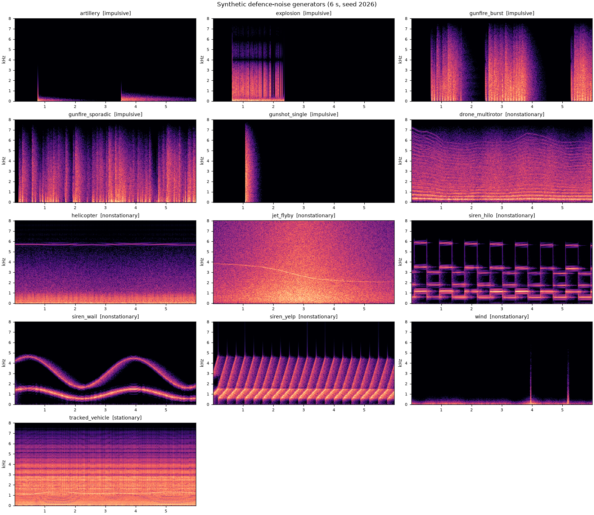
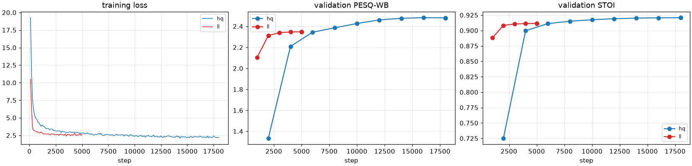
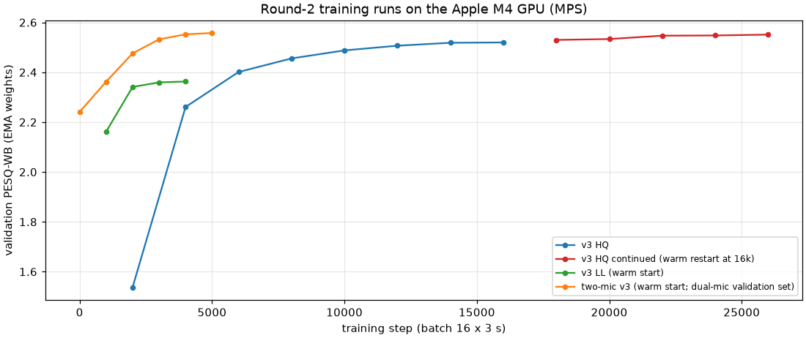
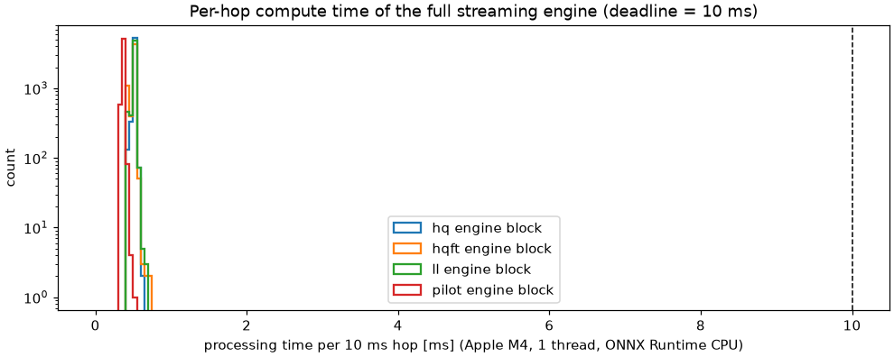
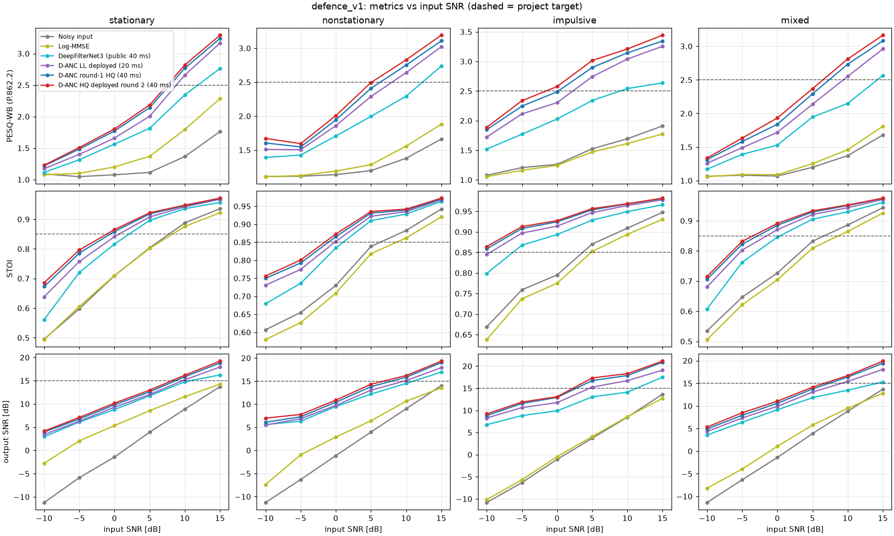
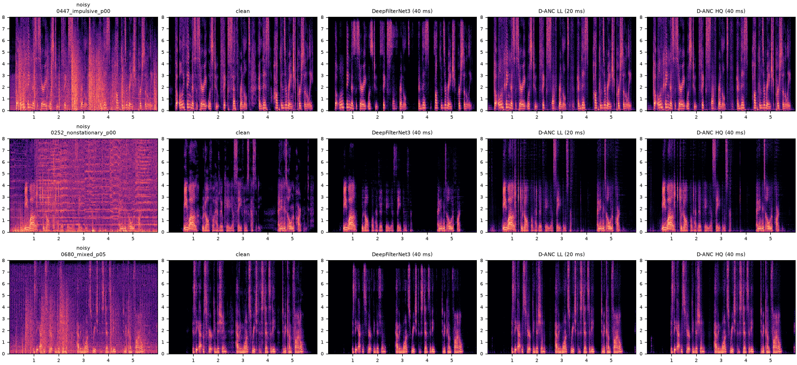
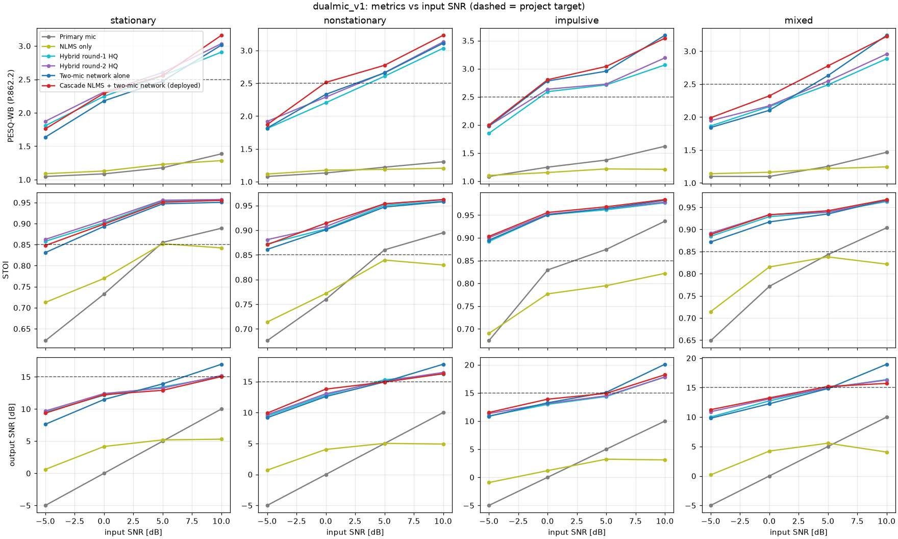
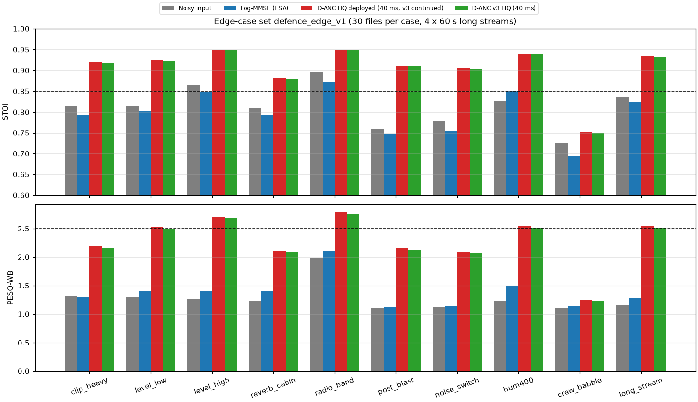
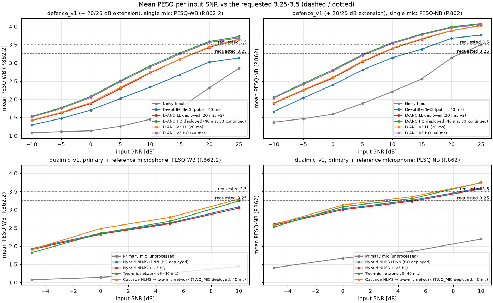
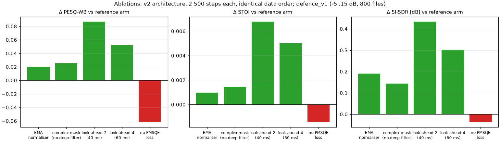

# D-ANC: Hybrid AI/ML Adaptive Noise Cancellation for Defence Voice Communications
### Technical report: research, design, implementation, validation

*Project folder:* `DRDO_Project/` · *Report date:* round 1 2026-10-03/04, round 2 2026-10-04/05 · *Development platform:* Apple M4 (MacBook Air, 16 GB) ·
*Target platform:* NVIDIA Jetson AGX Orin 64 GB (prepared, **not measured on hardware**)

Evidence conventions used throughout:
- **[V]** means the claim was re-checked against its primary source by an independent adversarial checker on 2026-10-03. That check confirmed 47 of 54 claims and corrected 7; the corrected wording is used here. See `docs/research/claims_verification.md`.
- **[N]** marks material from the research notes in `docs/research/T1..T7` that was fetched but not re-checked.
- **[M]** marks a measurement made in this project. Its script and raw data are in the repository.
- **[E]** marks an engineering estimate. It has not been measured.
- All published PESQ, STOI and SNR figures quoted here come from civilian benchmarks: VoiceBank+DEMAND (VB-D), DNS Challenge sets and WSJ0 mixtures. **None of them uses defence noise or the SNRs of this brief, so they are not directly comparable with the defence-test-set numbers in §8.**

---

## 0. Executive summary

**What was built (round 1, 2026-10-03/04).** D-ANC is a complete, tested, real-time hybrid noise-cancellation system for defence voice. It consists of:
- a reproducible data pipeline: public corpora with SHA-256 provenance, and 13 physics-based generators for gunfire, artillery, rotor, drone, siren and wind noise;
- DANCNet, a causal complex-domain sub-band/full-band network with a deep filter;
- a reference-microphone sub-band NLMS coupled to the network through its speech-presence output;
- a training framework with compressed spectral, MR-STFT, SI-SDR and PMSQE perceptual losses;
- a streaming ONNX engine numerically equivalent to the trained model;
- a Jetson AGX Orin deployment kit.

**What round 2 added (2026-10-04/05).**
- **Training on the M4 GPU:** 10 training runs, 21.8 h of GPU time.
- **A larger network (v3).** It was then trained further.
- **A two-microphone network**, run behind the NLMS.
- **An edge-case test set** of 11 conditions, plus a dual-microphone crew-babble set and a 20/25 dB extension of the defence set.
- **Controlled ablations:** a reference arm plus five single changes.
- **Paired confidence intervals** for every key comparison.
- **A reference-microphone health monitor** with a hot-standby fallback network.
- **A deployment self-check that covers all three deployed configurations.**
- **Pre-registered decision rules:** every model change was adopted or rejected under a rule written before its test result existed (§8.10). For the cascade, the *idea* came from the test result of the plain two-mic network; this is disclosed in its rule. Its configuration was fixed and checked on validation scenes before its single test run.

**Deployed after round 2** (all numbers measured on held-out speakers and test-only noise **[M]**):

| Defence test set, 1 mic, input SNR −5…15 dB (800 files) | PESQ-WB | PESQ-NB | STOI | output SNR | SI-SDR |
|---|---|---|---|---|---|
| Noisy input | 1.34 | 1.94 | 0.815 | 3.8 dB | 3.8 dB |
| Best classical method (log-MMSE) | 1.44 | 2.09 | 0.798 | 5.9 dB | 5.1 dB |
| DeepFilterNet3, public causal reference model (40 ms) | 2.04 | 2.75 | 0.885 | 11.8 dB | 11.7 dB |
| D-ANC LL, 20 ms (deployed, unchanged) | 2.33 | 2.98 | 0.904 | 13.0 dB | 13.3 dB |
| D-ANC HQ round 1, 40 ms | 2.44 | 3.10 | 0.914 | 13.9 dB | 14.0 dB |
| **D-ANC HQ round 2, 40 ms (deployed)** | **2.51** | **3.17** | **0.918** | **14.3 dB** | **14.3 dB** |

| Dual-mic headset scenes, primary + reference mic, −5…10 dB (240 scenes) | PESQ-WB | PESQ-NB | STOI | output SNR |
|---|---|---|---|---|
| Primary microphone, unprocessed | 1.23 | 1.78 | 0.798 | 2.5 dB |
| NLMS only | 1.18 | 1.65 | 0.788 | 3.2 dB |
| Hybrid NLMS + DNN, round-1 HQ | 2.43 | 3.05 | 0.928 | 13.4 dB |
| Hybrid NLMS + DNN, round-2 HQ | 2.50 | 3.12 | 0.932 | 13.5 dB |
| **Cascade NLMS → two-mic network (deployed for two-mic headsets)** | **2.62** | **3.20** | **0.931** | **13.7 dB** |

| Crew babble: 2–3 other talkers 0.6–2 m away + vehicle bed (60 dual-mic scenes) | PESQ-WB | STOI | SI-SDR |
|---|---|---|---|
| Primary microphone, unprocessed | 1.12 | 0.740 | 3.5 dB |
| Single-mic round-2 HQ | 1.27 | 0.773 | 5.6 dB |
| Hybrid NLMS + round-2 HQ | 1.37 | 0.825 | 7.8 dB |
| **Cascade NLMS → two-mic network** | **2.06** | **0.904** | **12.5 dB** |

**Against the brief's targets** (SNR > 15 dB, STOI > 0.85, PESQ-WB > 2.5):
- **STOI > 0.85 is met on average** on the main defence and dual-mic test sets (0.918 single-mic, 0.931 with two mics). It is not met on crew babble with one microphone (0.753); with two it is (0.904). Single-mic it holds from 0 dB input. With the two-mic cascade it holds at every tested SNR, including −5 dB (0.878).
- **PESQ-WB > 2.5 is now met on average, but only just:** 2.51 over −5…15 dB (round 1: 2.44). The 95 % CI is 2.47–2.55, so the mean sits at the threshold. 49 % of files exceed 2.5, and including the −10 dB stress files the average is 2.40. Single-mic it is met from 5 dB input (2.52). With two mics it is met from between 0 and 5 dB (2.48 at 0 dB, 2.79 at 5 dB).
- **SNR > 15 dB** is met from 10 dB input (16.8 dB single-mic, 16.3 dB two-mic). It is just missed at 5 dB (14.7 dB), so the −5…15 dB average is 14.3 dB.
- **Not met at −10 to −5 dB**, where the literature also does not meet them (§1).
- **D-ANC beats DeepFilterNet3,** a strong public causal model (not trained on defence noise). The round-2 HQ model leads by +0.47 PESQ-WB, +0.032 STOI and +2.6 dB SI-SDR on the defence set (DeepFilterNet3 is better on the civilian VoiceBank benchmark, which includes its training speakers; §8.3).

**PESQ "3.25–3.5 in all cases" (round-2 request) and "above 4" (round-1 request): reached only where the input SNR allows it.** These figures were measured, not extrapolated (§8.7, Tables R12a–d), using a 20/25 dB extension of the defence set.
- The deployed HQ model's *mean* PESQ-NB reaches 3.25 from 5.3 dB input SNR and 3.5 from 9.1 dB.
- Its mean PESQ-WB reaches 3.25 from 14.7 dB and 3.5 from 18.6 dB.
- With the reference microphone, on the dual-mic scenes, the two-mic cascade reaches a mean PESQ-NB of 3.25 from 2.6 dB and PESQ-WB 3.25 from 9.6 dB. On the *same* scenes the single-mic HQ network needs 7.1 dB for PESQ-NB 3.25. The defence set uses a nominal active-speech SNR about 1.2 dB above its whole-signal SNR, so its thresholds are not directly comparable with the dual-mic ones.
- At 25 dB input the mean PESQ-NB is **4.08** (PESQ-WB 3.72).
- At −10 to 0 dB no configuration reaches 3.25 (single-mic PESQ-WB 1.53–2.08). Meeting the request in every case needs more SNR at the microphone, from a noise-cancelling boom mic, an in-ear or throat sensor, or the reference mic (§8.7), not a different algorithm.
- PESQ is an engineering proxy that ITU-T has marked out of date. MRT listening tests are the acceptance criterion (§7).

**What round 2 measured that matters for fielding.**
1. **Crew babble** (other crew members talking) was the one edge case where one microphone barely helps (single-mic edge set: STOI 0.725 → 0.753). On the dual-mic crew-babble scenes, the two-mic cascade raises STOI from 0.740 unprocessed to **0.904**. These are simulated headset scenes. For a crewed platform, **two-microphone headsets are the recommendation.**
2. **The other edge cases are robust:** heavy clipping, −45 dBFS talkers, radio-band speech, post-blast recovery, 400 Hz hum, abrupt noise changes and 60 s streams (§8.6). Far-field reverberant speech is the next weakest case.
3. **Ablations** (§8.8, 95 % CIs):
   - Look-ahead (+0.087 PESQ-WB) and the PMSQE perceptual loss (−0.062 without it) are confirmed.
   - Two round-1 design choices showed **no** measurable benefit: the median normaliser and the deep filter. They are reported as negative results.
4. **Three bugs were found by testing and an independent code review, and fixed:** two in the deployment path, one in training (§6.3, §10):
   - a Jetson live-runtime crash after 30 s;
   - loss of the averaged (EMA) weights on training resume;
   - a reference monitor that would have flapped in a quiet room.

**Real time.** On one Apple-M4 core, unpaced, the deployed HQ engine takes 0.67 ms mean and 0.75 ms p99.9 per 10 ms hop. The two-mic configuration, with two networks per hop, takes 1.27 ms and 1.41 ms; neither missed a deadline **[M]**. In paced real-time simulation on the Mac desktop (no real-time priority), HQ and LL had no late blocks. The two-mic configuration had 2 late blocks in 11 800, in one run (§8.5): it has the least real-time margin. Jetson AGX Orin latency and power were **not measured**. The deployment kit (`deploy/jetson/QUICKSTART.md`) gives step-by-step instructions and a self-check (`verify_install.py`) for doing so on the hardware.

**Main limitations, stated plainly.**
1. Noise is partly synthetic, and the dual-mic and crew-babble scenes are simulated. Field recordings with the target headset are required (§9, R1).
2. The models are trained on about 25 h of speech on a fanless laptop. The continuation run still gained +0.03 PESQ-WB, so more data and training would help (R11).
3. MRT listening tests through the real radio chain remain to be done.
4. The v3-LL model was better on every metric of the defence test set and VoiceBank+DEMAND, and on clean transparency but missed its pre-registered bar. Switching to it is left as an owner decision (`reports/results/v3_decision_ll.md`).

*The round-1 version of this report is preserved as `reports/REPORT_round1.md`.*

---

## 1. Problem framing and how the targets are interpreted

**What "ANC" means here.** The brief mixes two different technologies.

- *Acoustic* active noise control injects anti-noise into the ear. It needs microphone-to-loudspeaker latency of tens to hundreds of **microseconds**. For example, an open-ear ANC prototype reported a 113 µs median latency, and its noise reduction fell from 11.1 dB at 45 µs to 4.4 dB at 726 µs (Yuan et al., arXiv 2604.05519, Apr 2026, preprint) [V]. That work belongs on the headset's dedicated codec or DSP, not on a Jetson-class SoC.
- What this brief needs is **transmit-path adaptive noise cancellation**, the classic Widrow two-microphone configuration (Proc. IEEE 63(12), 1975) [V], combined with DNN speech enhancement. It cleans the talker's microphone signal before it reaches the radio or intercom, and the listener hears the enhanced speech. Its latency budget is measured in **milliseconds**.

D-ANC is a transmit-path system. Earcup acoustic ANC is complementary and out of scope (see §7).

**Targets and their exact meaning in this project.**

| Target | Definition used | Why |
|---|---|---|
| SNR > 15 dB | Output SNR = 10·log10(Σs² / Σ(s−ŝ)²) on the enhanced signal, i.e. non-scale-invariant SDR. ΔSNR and SI-SDR are also reported. | Penalises residual noise **and** speech distortion. SI-SDR (Le Roux et al., ICASSP 2019) [V] is reported alongside. |
| STOI > 0.85 | STOI (Taal et al., IEEE TASLP 19(7), 2011) [V], plus ESTOI (Jensen & Taal, TASLP 24(11), 2016) [V] | ESTOI is more sensitive to modulated maskers such as rotor and gunfire. |
| PESQ > 2.5 | **Wideband** PESQ, ITU-T P.862.2 (MOS-LQO range ≈1.04–4.64) [V]. Narrowband P.862 is also reported. | WB-PESQ is the stricter scale. The narrowband score is closer to an 8 kHz tactical-vocoder channel. ITU-T has marked P.862/P.862.2 out of date and points to P.863 (POLQA) [V], so PESQ is used here as the de-facto research metric the brief requests. |
| Latency | Algorithmic latency (window plus look-ahead), plus measured compute per 10 ms hop, plus I/O buffering | Two-way comms: ITU-T G.114 calls < 150 ms mouth-to-ear "essentially transparent" for most applications [V]. The DNS Challenge real-time track caps algorithmic latency at 40 ms [V]. The AEC Challenge 2023 used algorithmic + buffering ≤ 20 ms [V]. |

**The targets must be read against input SNR.** The literature shows that the targets are reachable near 0 dB input and above, but not at −5 dB with today's causal models:
- **Tan & Wang 2018, causal CRN** [V]: STOI 76.4 % and PESQ 2.04 at −5 dB on babble/cafeteria noise.
- **Tan & Wang 2020, GCRN** [V]: STOI 90.1 % and PESQ 2.65 at 0 dB; STOI 80.8 % and PESQ 2.13 at −5 dB.
- **Xu et al. 2015, unseen NOISEX-92 noise** [V]: PESQ 2.60 and STOI 0.876 at 5 dB, but only 1.89 and 0.688 at −5 dB.
- **Mukhutdinov et al., IEEE Access 2023** [V]: for drone ego-noise at −15 dB, the best of 12 DNNs reaches only PESQ 1.9 and ESTOI 0.4.

D-ANC therefore reports every metric **per input SNR and per noise category**.

**On "PESQ > 4".** The project owner asked for PESQ above 4. On wideband PESQ that has not been achieved on any public benchmark by any causal or non-causal system we could find:
- **Best non-causal systems on the comparatively mild VB-D test set (2.5–17.5 dB SNR)** [V]: CMGAN 3.41, MP-SENet 3.50, SEMamba 3.55 (3.69 with perceptual contrast stretching).
- **Best causal systems** [V]: BASENet-causal 3.44 (Thales, preprint, Jun 2026), FRCRN 3.21, DeepFilterNet3 3.17.

D-ANC reports where PESQ-NB and PESQ-WB exceed 4 by condition, and does not claim an average that the physics and the literature do not support. §8 has the details.

---

## 2. State of the art and the architecture decision

### 2.1 Evidence table: causal or real-time speech enhancement

| Model (venue, date) | Params / compute | Latency | Published quality *(test set — not defence)* | Licence | |
|---|---|---|---|---|---|
| RNNoise (IEEE MMSP 2018) | 87,503 weights | 20 ms window, 10 ms hop, 48 kHz | (DSP/DL hybrid) | BSD-3 | [V] |
| DeepFilterNet2 (IWAENC 2022) | 2.31 M / 0.356 GMAC | 40 ms (2-frame look-ahead) | VB-D PESQ 3.08 (3.03 with post-filter); RTF 0.04 on i5-8250U, 0.42 on Raspberry Pi 4 | MIT / Apache-2.0 | [V] |
| DeepFilterNet3 (Interspeech 2023 show & tell) | ≈2.1 M / 0.35 GMAC (per DPDFNet paper) | 40 ms | VB-D PESQ 3.17, STOI 0.944; RTF 0.19 single-thread i5-8250U | MIT / Apache-2.0 | [V] |
| GTCRN (ICASSP 2024) | 48.2 K / 33 MMAC/s | 0 look-ahead | VB-D PESQ 2.87, STOI 0.940, SI-SNR 18.83 | MIT | [V] |
| ULCNet (ICASSP 2024) | 688 K / 0.098 GMAC | 32 ms window | VB-D PESQ 2.87 (ULCNet_MS); RTF 0.127 on 1 Cortex-A53 core | (no public code found) | [V] |
| LiSenNet (ICASSP 2025) | 37 K / 56 MMAC/s | 0 look-ahead | VB-D PESQ 3.07 (with PESQ loss) | MIT | [V] |
| UL-UNAS (IEEE TASLP, 2026) | 171 K / 35 MMAC/s | 0 look-ahead | VB-D PESQ 2.96, or 3.09 with PESQ loss | MIT | [V] |
| FRCRN (ICASSP 2022) | 6.9 M (16 kHz) | 30 ms | VB-D PESQ 3.21 | Apache-2.0 | [V] |
| BASENet-causal (arXiv Jun 2026, Thales) | 0.81 M / 7.1 GMAC | not stated | VB-D PESQ 3.44 (preprint) | none | [V] |
| DPDFNet-8 (Speech Communication 2026, Ceva) | 3.5 M / 4.4 GMAC | ≈40 ms | own 0/5/10 dB multilingual set: PESQ 3.20 vs DFN3 2.76 vs GTCRN 2.21 (v3 values) | Apache-2.0 | [V] |
| Non-causal ceiling: CMGAN / MP-SENet / SEMamba | 1.8–2.3 M | offline | VB-D 3.41 / 3.50 / 3.55 | MIT | [V] |

### 2.2 Decision

The decision is a **DeepFilterNet/GTCRN/DPCRN-family hybrid, re-designed for 16 kHz defence voice**. It is not a time-domain model and not a generative one. The reasons:

1. **Compute fits the edge with margin.** The two-stage "envelope gain + deep filter" family reaches the best quality per MAC among causal models: DFN2/3 at about 0.35 GMAC/s, and GTCRN/UL-UNAS at tens of MMAC/s [V]. D-ANC's round-1 models need 0.37 GMAC/s (LL-small) to 0.76 GMAC/s (v2), counted analytically. The full engine block takes 0.5 ms per 10 ms frame on a single M4 core (2.1 ms mean in paced real time) [M]. Round 2: the deployed v3 HQ needs 1.37 GMAC/s and takes 0.67 ms unpaced (2.7–2.8 ms mean paced). The two-network two-mic configuration takes 1.27 ms unpaced and 3.1–4.1 ms paced [M] (§6, §8.5).
2. **Complex domain and phase.** The output is a complex deep filter in the 0–3.15 kHz band, so phase is enhanced, not just copied from the noisy input. This band carries voiced-speech harmonics and also rotor, engine and track-slap lines. The research notes caution that DFN's deep filter was designed for periodic *speech*, and that its effect on periodic *noise* had to be measured [N]. §8 measures it.
3. **Sub-band and full-band processing, as the brief requires.** Sub-band feature unfolding and per-band temporal GRUs model local statistics. An intra-frame bidirectional GRU across frequency models global spectral structure, which is legal because it does not look into the future.
4. **Generative or diffusion enhancers are excluded for safety-critical voice.** The Interspeech 2025 URGENT challenge found that generative enhancers can hallucinate content and that DNSMOS rated hallucinated output highly [N]. A command channel must never invent words.
5. **16 kHz instead of 48 kHz.** Tactical radio vocoders are narrowband (MELPe at 2400 bit/s uses 22.5 ms frames at 8 kHz [V]). 16 kHz keeps wideband intelligibility cues up to 8 kHz at one-third of the compute of full-band models.

---

## 3. Component 1: Scalable dataset pipeline

### 3.1 Sources and licences, all fetched and hashed by `danc.data.download` (except the partial train-clean-100 stream, whose prefix hash was not recorded; see its provenance note)

| Corpus | Content used | Licence | Notes |
|---|---|---|---|
| LibriSpeech dev-clean, test-clean; Mini-LibriSpeech train-clean-5 | Clean speech | CC BY 4.0 [V] | Speaker-disjoint train (62 speakers, 9.9 h), val (6 speakers, 0.8 h), test (40 speakers, 5.4 h) |
| LibriSpeech train-clean-100, **partial** | +35 speakers, 15 h (v2 training set: 97 speakers, 25 h) | CC BY 4.0 [V] | Streaming stopped at about 1.0 GB because of disk space. One truncated file was excluded, not deleted. |
| NOISEX-92, 15 recordings (SPIB mirror) | F-16 and Buccaneer cockpits, Leopard and M109 vehicles, .50 cal machine gun, destroyer engine room and operations room, babble, factory, HF channel, Volvo | © TNO 1990, NATO RSG-10 distribution; **redistribution terms unclear** [V] | 235 s per type at 19.98 kHz, resampled to 16 kHz. Train on the first 75 %, test on the last 20 %. |
| ESC-50, 16 defence-relevant classes | Helicopter, siren, engine, airplane, wind, fireworks, chainsaw, train, thunderstorm, rain, crackling fire, hand saw, car horn, glass breaking, door knock, sea waves | **CC BY-NC 3.0, non-commercial** [V] | Folds 1–4 train, fold 5 test |
| DroneAudioDataset (Al-Emadi et al.) | Bebop and Mambo propeller noise | **No licence file** [V]; internal R&D only, not for redistribution | 80/20 hash split |
| VoiceBank+DEMAND test (16 kHz mirror) | 824 pairs; public benchmark only | CC BY 4.0 [V] | Never used for training |
| Synthetic generators, `danc.data.synth_noise` | 13 defence noise types (§3.2) | Project-generated | Disjoint seed streams for train and test |
| RIR bank (pyroomacoustics image-source method) | 300 train + 300 test RIRs, target RT60 0.1–0.8 s. Far-field median RT60 ≈ 0.50 s by T20 fit (0.37 s two-point estimate); near-field RIRs are dominated by the direct path (`scripts/rir_stats.py` → `reports/results/rir_stats.json`) | Project-generated | Near-field (talker 3–12 cm) and far-field (noise 1–6 m) |

**Data gaps, flagged rather than guessed.**
- No openly licensed corpus was found of artillery, armoured-vehicle or gunfire noise recorded at a headset microphone together with speech [N].
- The best open gunshot corpora are licensed but were **not** used here, because disk space and the user's choice limited downloads: the Kabealo & Wyatt edge-device gunshot set (CC BY 4.0, 1.57 GB) and the Free Firearm Sound Library (CC0) [N].
- DREGON drone data is academic-only.
- DroneAudioSet (NeurIPS 2025, MIT, 42.6 GB) is the most relevant open drone ego-noise corpus but is too large for this machine [N].

### 3.2 Physics-based synthetic defence noise (`synth_noise.py`)

The table below summarises the models. `reports/figures/synth_noise_grid.png` shows the spectrograms; wav examples are in `data/synthetic_examples/`.

| Kind | Model |
|---|---|
| gunshot_single / gunfire_burst / gunfire_sporadic | Modified-Friedlander muzzle blast with positive phase 0.5–3 ms, stretched with distance up to about 5 ms; Maher (IEEE SAFE 2007) notes muzzle blast typically lasts < 3 ms [V]. Optional supersonic N-wave arriving earlier; ground reflection; distance-dependent air-absorption low-pass; open, urban, forest or indoor echo tails. Automatic fire at 600–1000 rounds per minute. |
| artillery / explosion | Friedlander positive phase 5–50 ms (artillery) or 2–10 ms (close explosion); strong rumble below 250 Hz with 1–4 s decay; optional incoming whistle (artillery); debris crackle (explosion). |
| helicopter | Main-rotor blade-passing frequency 10–30 Hz with harmonics; the Black Hawk BPF is about 17 Hz [V]. Blade-vortex-interaction "slap" pulse per blade passage, tail-rotor BPF of 50–120 Hz, turbine tones from 1–6 kHz, rotor-modulated broadband noise, optional Doppler fly-by. |
| drone_multirotor | 4–8 rotors with BPF 80–400 Hz, RPM jitter, manoeuvre drift, 10–30 harmonics, motor whine and turbulence. |
| siren_wail / yelp / hilo | Odd-harmonic sweeps (wail 0.1–0.5 Hz, yelp 2–5 Hz) and two-tone alternation, with Doppler. |
| wind | Low-frequency turbulence with gust envelopes and pops. This is a simplified version of the Nelke & Vary (IWAENC 2014) approach [V]. |
| tracked_vehicle, jet_flyby | Diesel firing harmonics, track-slap impulses, gearbox whine; jet-mixing hump with Doppler fan tones. |



These generators add **parametric variety, not field realism**. Validating on recorded range and vehicle noise is listed as a required next step (§9).

### 3.3 Mixing recipe (`mixer.py`, dynamic mixing, so no mixture is ever reused)

- **Speech.** A 3 s crop for the v2 runs (4 s for the pilot and the validation set), set to an active level of −40 to −15 dBFS using a P.56-*style* frame-based active level. This is not a compliant P.56 implementation.
- **Noise category.** Stationary 25 %, non-stationary 35 %, impulsive 20 %, mixed "battlefield" 20 % (a stationary or non-stationary bed plus impulsive events; with p = 0.4 a third non-stationary layer such as rotor, drone or siren).
  - Within a category, sources are drawn family-balanced across NOISEX, ESC-50, drone and synthetic, so that 300 drone clips do not swamp 10 NOISEX files.
  - Impulsive scenes get a weak background bed with probability 0.6, because real fire never happens in silence.
- **SNR.** Uniform −10…20 dB for stationary and non-stationary noise, −10…15 dB for impulsive and mixed. SNR is active-speech power over whole-segment noise power at the microphone.
- **Augmentation.**
  - Near-field room reverb on speech (p = 0.25; the target keeps the direct path plus the first 50 ms).
  - Far-field reverb on noise (p = 0.35).
  - **ADC/pre-amp clipping** (p = 0.10; drive 1.2–4× full scale, hard or tanh). Firearm peaks of roughly 140–175 dB SPL [V] saturate headset microphones.
  - Microphone EQ (p = 0.2), applied to both input and target.
  - Noise-only examples (p = 0.02, target = silence) and clean-only examples (p = 0.02).
- **Dual-microphone scenes (`dual_mic.py`).** Primary boom mic plus an outward-facing reference mic 8–15 cm away.
  - 1–3 directional sources with fractional-delay propagation, early reflections and head or helmet shadowing.
  - A diffuse field with spherically-isotropic coherence sinc(2πfd/c) (Habets & Gannot 2007).
  - Talker leakage into the reference at −25…−12 dB, plus microphone self-noise.

### 3.4 Fixed evaluation sets (`build_testset.py`; FLAC with metadata, rebuildable from seeds)

- **defence_v1:** 900 mixtures of 6 s. Four categories × SNR {−5, 0, 5, 10, 15} dB × 40, plus a −10 dB stress condition with 4 × 25. Unseen speakers and test-split noise only.
- **dualmic_v1:** 240 headset scenes (primary, reference, clean). Four categories × SNR {−5, 0, 5, 10} dB × 15.
- **VoiceBank+DEMAND test:** 824 pairs, a published civilian benchmark used for comparison only.

### 3.5 Round-2 additions: edge cases, dual-microphone training data, crew babble

- **Edge-case test set `defence_edge_v1`** (`danc.data.build_edgeset`, 304 files, 64 MB; test speakers and test-split noise only). These are conditions a fielded headset meets that the main test set does not isolate:

| Case | Construction | Why it matters |
|---|---|---|
| `clip_heavy` | Impulsive or mixed noise at 0/5 dB, then hard ADC clipping at 2–6× full scale (target unclipped) | Gunfire saturates headset microphones and ADCs |
| `level_low` | Talker at −45 dBFS active level, noise at 0/5/10 dB | Very low mic gain, quiet talker |
| `level_high` | Mixture peak-normalised to 0.98 full scale (no clipping) | Hot mic gain |
| `reverb_cabin` | Talker 1–6 m from the mic through a far-field RIR; target = direct path + 50 ms | Vehicle cabins, shelters, mic off the boom |
| `radio_band` | Mixture and target band-limited to 300–3400 Hz (6th-order Butterworth) | Speech already through a narrowband radio leg |
| `noise_only` | No talker; noise at −26 dBFS | The output must stay quiet (attenuation in dB) |
| `post_blast` | Explosion 25–35 dB above the talker; speech 50–300 ms later | The normaliser and recurrent state must recover at once |
| `noise_switch` | Three 2 s noise segments of different categories joined abruptly | Tracking non-stationary scenes |
| `hum400` | 400 Hz aircraft power hum with harmonics + 50 Hz mains hum | Tonal interference in airborne platforms |
| `crew_babble` | 2–3 competing test speakers at TIR 0/5/10 dB + vehicle bed | Other crew talking: the hardest case for one microphone |
| `long_stream` | 4 × 60 s, several utterances, noise type changes every 10 s | State drift and stability in continuous operation |

- **Dual-microphone training generator** (`danc.data.dual_mixer`). Every training example is a new headset scene rendered by the same simulator as the dual-mic test sets (§3.3), from training speakers and training-split noise. It includes clipping of both microphones, an independent EQ per microphone, timbre/bandwidth augmentation, and clean-only and noise-only examples. Sparse impulsive noise could produce an all-silent noise window, which crashed the first two-mic run at step ≈ 2 500. The noise is now redrawn up to five times, then given a −80 dB floor (`tests/test_two_mic.py`).
- **Dual-microphone crew-babble test set `dualmic_babble_v1`** (`danc.data.build_dual_babble`, 60 scenes). It was added after the single-mic edge cases showed crew babble to be the weakest case. The wearer is close-talk at the boom mic. 2–3 other test speakers are directional sources 0.6–2 m away, reaching both microphones at similar level. A diffuse vehicle bed sits 10 dB below the wearer. TIR at the primary is 0/5/10 dB (measured input SNR −0.4/3.8/7.0 dB including the bed).

---

## 4. Component 2: Model architecture (DANCNet)

```
 STFT frame X(t) [161 bins, 20 ms sqrt-Hann, 10 ms hop]
   │
   ├─ impulse-robust normaliser: divide by sqrt(median of last 64 frame energies)  ← a gunshot cannot move a median
   ├─ features: |X|^0.3 and compressed Re/Im  →  bins 0..63 kept (0–3.15 kHz), bins 64..160 → 32 ERB bands  (96 units)
   ├─ sub-band unfolding (each unit + 2 neighbours)  → 9 channels
   ├─ encoder: Conv(1×5,/2) → CausalConv(2×3,/2) → CausalConv(2×3)        [96 → 48 → 24 units]
   ├─ N × dual-path block:  BiGRU across frequency (full-band)  +  causal GRU across time (per sub-band)
   ├─ decoder: CausalConv + 2 × transposed conv with skip concatenation   [24 → 48 → 96]
   └─ heads (96 units):
        low band 0–3.15 kHz  → complex DEEP FILTER, N taps over frames t-N+1..t, output frame t-L
        high band 3.15–8 kHz → real ERB-band gains (sigmoid)
        all bands            → speech-presence probability (SPP), which gates the reference-mic NLMS
```

| Variant | Width / dual-path blocks | Deep-filter taps / look-ahead L | Algorithmic latency | Params | MAC per frame | GMAC/s |
|---|---|---|---|---|---|---|
| LL-small (pilot, design check) | 64 / 2 | 3 / 0 | 20 ms | 164 K | 3.67 M | 0.37 |
| **v2-HQ** | 80 / 3 | 5 / 2 | **40 ms** | 340 K | 7.64 M | 0.76 |
| **v2-LL** (warm-started from v2-HQ) | 80 / 3 | 5 / 0 | **20 ms** | 340 K | 7.64 M | 0.76 |
| **v3-HQ** (round 2) | 96 / 4 | 5 / 2 | **40 ms** | 609 K | 13.75 M | 1.37 |
| **v3-LL** (round 2, warm-started from v3-HQ) | 96 / 4 | 5 / 0 | **20 ms** | 609 K | 13.75 M | 1.37 |
| **v3 two-microphone** (round 2, warm-started from v3-HQ) | 96 / 4, primary **and** reference features | 5 / 2 | **40 ms** | 610 K | 13.81 M | 1.38 |

**Deployed after round 2** (`exports/deployment_selection.json` → `exports/DEPLOYMENT.json`; round 1 kept in `exports/DEPLOYMENT_round1.json`):
- **HQ**: v3-HQ continued (`exports/dancnet_v3hq_cont.onnx` ← `checkpoints/v3hq_cont/best.pt`, 40 ms).
- **LL**: v2-LL, unchanged (`exports/dancnet_ll.onnx`, 20 ms). v3-LL missed its pre-registered bar and is left as an owner decision (§8.10).
- **TWO_MIC**, for two-microphone headsets: the gated NLMS feeding the two-microphone v3 network (`exports/dancnet_v3_2mic.onnx`), with the HQ model in hot standby for a dead reference.

Every change was made under a pre-registered rule (§8.10). Round-1 deployment: HQ = v2-HQ plus the robustness/PESQ-guided fine-tune (`exports/dancnet_hqft.onnx`); LL as above.

**Round-2 architecture changes and why.**
- **More capacity (v3).** A per-band diagnosis of the round-1 deployed HQ model was run ad hoc in the session at 08:39 on 2026-10-04, 1.5 min before the v3 rule was written. It was later reproduced as `scripts/band_error_analysis.py` → `reports/results/band_error_analysis.csv`, on 160 defence files at −5/0/5/15 dB input. It found no single failing band:
  - About 80 % of the speech energy lies below 1 kHz.
  - At 15 dB input, the output band SNR is 17–21 dB and the log-spectral distance 5–6 dB in *every* band. At −5 dB input the LSD is 7–10 dB in every band.
  - Below 1 kHz, where the speech energy is, the enhancement gain at 15 dB input is smallest: +3.4 to +5.1 dB, against +5.7 to +13.2 dB above 1 kHz.

  A band-specific fix was therefore unlikely to help. A speech-presence post-filter, tested in parallel *after* the v3 decision, confirmed this (§8.9). The remaining lever was model capacity: width 80 → 96 and 3 → 4 dual-path blocks. Compute rises from 0.76 to 1.37 GMAC/s; DeepFilterNet2/3 are about 0.35 GMAC/s. In the same analysis, v3 changes the output band SNR by −0.1 to +0.7 dB per band, and by +0.1 to +0.6 dB below 1 kHz at 0–15 dB input.
- **Two-microphone network.** The round-1 hybrid feeds the reference mic only to a *linear* canceller (NLMS), which cannot use the reference above about 1–2 kHz where the noise field decorrelates (§6.2). The two-microphone variant gives the network the reference mic's features directly: 18 instead of 9 input channels in the first encoder layer, with everything after it unchanged. The network can then learn non-linear spatial cues, chiefly the level difference between the close-talk wearer and distant noise, per frequency band. It is warm-started from v3-HQ with the reference filters at zero, so training starts exactly from the single-mic model (`danc.train.train_dual`). The NLMS is bypassed for this network.
- **Reference-mic health monitor (engine, opt-in).** A two-microphone network must not be fed a dead reference it never saw in training. With `--fallback-onnx <single-mic model>`, the engine keeps a single-mic network in hot standby. Levels are DC-removed and smoothed over about 100 ms. The reference counts as dead when it is at digital silence (< −100 dBFS) or ≥ 40 dB below an *active* primary (> −60 dBFS), for 0.5 s. The engine then cross-fades to the standby network over 100 ms, and back after 0.5 s within 30 dB of an active primary. When both microphones are quiet (a quiet room, speech pauses), there is no evidence either way and the state is kept. A first version used only an absolute threshold, and the code review showed it flipping networks in a quiet room and missing a dead mic with a DC offset. Both cases are now regression tests. While the reference is healthy the output is bit-identical to the plain two-mic engine (`tests/test_two_mic.py`).
- **Optional normaliser variant** (`norm_type: ema`), used only for the ablation in §8.8. The median normaliser stays the default.

**Design choices and how each serves the targets:**
- **Impulse-robust median normaliser.** A gunshot 40 dB above speech lasts a few frames. An exponential-mean normaliser, as in DFN, would be pulled up for hundreds of milliseconds and under-scale the speech that follows. A 0.64 s running median ignores events shorter than about 0.3 s. The state starts all-zero and is valid that way, which TensorRT and ONNX initialisation require. *Round-2 ablation (§8.8): the expected benefit was **not** measurable. An exponential-mean normaliser was slightly better overall (+0.020 PESQ-WB) and equal in post-blast recovery.*
- **Look-ahead L = 2 (HQ mode).** With look-ahead the network sees a blast onset 20 ms before it must emit that frame, so it can suppress the onset frame itself instead of reacting one frame late. The cost is 20 ms more latency, which is still within the DNS 40 ms real-time limit [V] and far inside G.114's 150 ms [V]. The 20 ms LL mode is kept for latency-critical use.
- **Deep filter (N complex taps) in the low band.** It models periodic components with sub-bin precision: voiced speech, and the rotor, engine and track-slap lines that the 50 Hz bin spacing cannot resolve. It is equivalent to DFN's deep filtering [V], with the trade-offs noted above. *Round-2 ablation (§8.8): without look-ahead, a single-tap complex mask was slightly better (+0.025 PESQ-WB), so the deep filter's added value is not demonstrated.*
- **SPP head.** Adds about 5 k MACs per frame (< 0.1 % of the network) and gives the adaptive filter a speech-aware step-size control (§6.2).
- **Exact streaming equivalence.** The network is written once, with explicit state tensors: convolution caches, GRU states, normaliser history and deep-filter history. Offline training and frame-by-frame streaming are numerically identical. The tests check this to ≤1e-4, PyTorch and ONNX Runtime both, including look-ahead [M].

---

## 5. Component 3: Training framework

| Item | Value | Basis |
|---|---|---|
| Loss | 1.0·L_cspec + 1.0·L_MR-STFT + 1.0·L_SI-SDR + 1.0·L_PMSQE + 0.5·L_asym + 0.1·L_SPP | See below. L_cspec has internal weights 30/70, and L_asym an internal ×100 scale (`losses.py`) |
| L_cspec | Power-law compressed (c = 0.3) complex and magnitude MSE, weighted 30·(Re/Im) + 70·mag | GTCRN HybridLoss [V]. Braun & Tashev found mixing compressed magnitude and complex losses best at β = 0.3 (with c = 0.3 adopted, not tuned) [V]. |
| L_MR-STFT | Spectral convergence + L1 on compressed magnitudes at n_fft 256/512/1024 | MR-STFT (Yamamoto et al. 2020) [N]; DFN uses a multi-resolution compressed loss [N]. Short windows matter for impulses. |
| L_SI-SDR | −SI-SDR in Bels, with silent targets masked | Le Roux et al. 2019 [V]; same scaling as the GTCRN code [V] |
| L_PMSQE (perceptual) | PESQ-inspired symmetric and asymmetric loudness disturbance on 32 ms frames | Martín-Doñas et al., IEEE SPL 25(11), 2018 [V]; Asteroid implementation vendored (MIT) |
| L_asym | Penalises only target-above-estimate compressed magnitude, i.e. speech removal | Asymmetric losses from VoiceFilter-Lite (Google, 2020) and PLCPA-ASYM (Microsoft, 2021) [N]. Protects STOI at very low SNR. |
| L_SPP | BCE against an IRM-style target, \|S\|²/(\|S\|²+\|N\|²) | Supervises the gating signal for the adaptive filter |
| Optimiser | HQ: AdamW, lr 1e-3, 1000-step warm-up, cosine decay to 2e-5, weight decay 1e-4, gradient clip 5, batch 16 × 3 s (pilot 4 s). LL warm start: lr 3e-4, 200-step warm-up, cosine to 1e-5. Fine-tunes: constant lr 5e-5 (D: 2e-4), gradient clip 3 | Matches DFN2/3 recipes (AdamW 1e-3, warm-up, cosine) [N] |
| EMA | Weight EMA including BatchNorm buffers, decay 0.999 (HQ) or 0.998 (LL and fine-tunes); used for validation, checkpoints and export | Standard practice |
| Model selection | Best validation PESQ + 2·STOI on 200 fixed val mixtures (6 held-out speakers, all categories, −5…15 dB) | |
| Perceptual fine-tune | MetricGAN+-style: a discriminator predicts true PESQ-WB; the generator pushes toward 1 while the full loss above stays as an anchor | MetricGAN+ (Interspeech 2021) reached VB-D 3.15 [V]. Adoption followed a **pre-registered rule** (`reports/results/finetune_decision_rule.md`): on the defence set ΔPESQ-WB ≥ −0.02, ΔSTOI ≥ −0.003 and ΔSI-SDR ≥ −0.2 dB; on VoiceBank, STOI up or PESQ +0.05; clean-input transparency not lower. |

**Runs actually performed** (logs in `logs/`, configs in `configs/`, curves in `reports/figures/training_curves.png`):

| Run | Initialisation | Data | Steps × batch × length | Wall time (M4 GPU) | Best validation PESQ-WB / STOI / SI-SDR |
|---|---|---|---|---|---|
| `pilot` (pipeline check, LL-small 164 k) | random | 10 h speech, no synthetic noise | 1 046 × 16 × 4 s | 0.25 h | 1.83 / 0.871 / 10.9 dB |
| `hq` (v2, 40 ms) | random | 25 h, 97 speakers + all noise incl. synthetic | 18 000 × 16 × 3 s | 5.7 h | 2.482 / 0.921 / 14.5 dB (step 16 000) |
| `ll` (v2, 20 ms) | warm start from `hq` | same | 5 000 × 16 × 3 s | 1.8 h | 2.348 / 0.912 / 13.8 dB |
| `hq_metric` (round-1 deployed HQ) | `hq` | + timbre/bandwidth aug. (p = 0.3), clean-only 8 %, PESQ discriminator (w = 2) | 2 000 | 1.1 h | final (deployed `last.pt`): 2.461 / 0.921 / 14.47 dB (start: 2.482) |
| `ll_metric` (not adopted) | `ll` | same | 2 000 | 1.1 h | final: 2.325 / 0.912 / 13.81 dB (start: 2.348) |



**Observations.**
- **EMA lag.** EMA validation lags early in training; at step 2 000, 13 % of the random initial weights are still in the average. It is beneficial later.
- **Diminishing returns.** Validation gains after step 12 000 were small (+0.02 PESQ), so a longer run on this data alone would not change the conclusions.
- **Cost of look-ahead.** Removing look-ahead (LL) costs about 0.13 PESQ-WB and 0.75 dB SNR between the base models on the defence test set, and 0.11 PESQ-WB and 0.9 dB between the round-1 deployed models (Table R1).
- **The PESQ-guided stage did not raise in-domain PESQ.** Its measured value is robustness: VoiceBank +0.13 PESQ and +0.012 STOI, and clean-speech transparency 2.98 → 3.56 PESQ (Table R10). The fine-tuned models were adopted or rejected by a **pre-registered rule** (`reports/results/finetune_decision_rule.md`). HQ was adopted. LL was rejected because it missed the defence-PESQ guard by 0.003.

### 5.1 Round 2: training on the Apple M4 GPU

**GPU use.** Every training run in both rounds runs on the M4's integrated GPU through PyTorch's Metal backend (MPS). Each log states it at start-up (`[train] v3hq: params=609156 device=mps`). The CPU cores generate the dynamic training mixtures (4 worker processes) and compute validation PESQ/STOI (3 processes), so the GPU only does the network forward and backward passes and the losses.
- **Mixed precision is not available.** MPS rejected half-precision inputs to the GRU kernels ("RNN input dtype" error, observed in the session, not logged), so training stays in fp32.
- **Batch size.** Measured on the otherwise idle GPU (`scripts/choose_batch.py` → `reports/results/batch_benchmark.json`): one full training step including PMSQE, MR-STFT, backward and AdamW, 3 s crops.

| Architecture | Batch 16 | Batch 24 | Batch 32 |
|---|---|---|---|
| v2 (340 K) | 1.05 s/step, 45.8 s audio/s, 4.4 GB | 1.44 s, 50.0 s/s (+9 %), 5.4 GB | 1.84 s, 52.1 s/s (+14 %), 7.2 GB |
| v3 (609 K) | 1.34 s/step, 35.8 s audio/s, 5.3 GB | 1.98 s, 36.4 s/s (+2 %), 8.4 GB | 3.11 s, 30.9 s/s (−14 %), 10.6 GB |

  The rule, fixed before the measurement, was to use a larger batch only if it gives ≥ 25 % more audio per second within 7 GB of GPU memory. No larger batch qualified: the GPU is already saturated at batch 16, and larger batches only add memory pressure on the 16 GB of unified memory shared with the data workers. Batch 16 was kept.
- **One training job at a time.** For the same reason the training runs were queued strictly one after another (`scripts/run_round2*_chain.sh`). Some CPU evaluations overlapped with training, so some wall times and evaluation durations include contention; no latency measurement overlapped with training. A batch benchmark started next to a training run pushed swap to about 7.3 GB, observed with `sysctl vm.swapusage` and not logged, and was stopped. The clean re-run in the queue is the one reported above.

**Round-2 runs** (logs `logs/<run>.out` and `logs/train_<run>.jsonl`, configs in `configs/`):

| Run | Initialisation | Data / augmentation | Steps × batch × length | Wall time (M4 GPU) | Best validation PESQ-WB / STOI / SI-SDR |
|---|---|---|---|---|---|
| `v3hq` (40 ms) | random | 25 h, 97 speakers, all noise; timbre/bandwidth p = 0.2, clean-only 5 %, noise-only 2 % | 16 000 × 16 × 3 s | 6.9 h | 2.520 / 0.923 / 14.67 dB (step 16 000) |
| `v3ll` (20 ms) | `v3hq` | same | 4 000 × 16 × 3 s | 1.7 h | 2.363 / 0.913 / 13.90 dB |
| `v3_2mic` (40 ms, two mics) | `v3hq` (reference filters at zero) | dual-mic scenes (§3.5); validated on `dualmic_val` | 5 000 × 16 × 3 s (the first invocation crashed at step ≈ 2 500; the resume restarted from the step-2 000 checkpoint, so about 5 500 steps were executed) | 1.4 h + 1.6 h | 2.558 / 0.927 / 14.08 dB on dual-mic validation (step 5 000) |
| `v3hq_cont` (40 ms) | `v3hq` (warm restart, peak LR 3e-4, new data seed) | same as `v3hq` | 10 000 × 16 × 3 s | 5.0 h | 2.551 / 0.925 / 14.80 dB (step 10 000) |
| 6 ablation arms `abl_*` (§8.8) | random, seed 101, identical data order | v2 recipe | 2 500 × 16 × 3 s each | 0.8–1.0 h each | Table R13 |

`v3_2mic` validation is on the dual-mic validation scenes, so its numbers are not comparable with the single-mic rows.



## 6. Component 4: Real-time inference engine

### 6.1 Streaming engine (`engine.py`, `runners.py`, `export_onnx.py`)

- **Per 10 ms hop:** shared STFT of both microphones → sub-band NLMS on the reference mic → one DANCNet step (ONNX) → inverse STFT → output peak limiter (−1 dBFS) for hearing protection and DAC headroom.
- **ONNX contract.** Input `spec [1,1,161,2]` plus 8 state tensors for the v2 models (≈48–52 KB; 7 tensors / 32 KB for the 2-block LL-small), or 9 (≈68 KB) for the v3 models. The two-microphone model adds a second input, `spec_ref [1,1,161,2]`, and its metadata carries `in_ch = 2`. Outputs are `spec_out`, `spp` and the updated states. All states start at zero. The look-ahead and STFT parameters are stored in the ONNX metadata.
- **Runners.** PyTorch, ONNX Runtime (CPU EP, with CUDA/TensorRT EPs on Jetson) and TensorRT 10 (`deploy/jetson/trt_runner.py`, untested on hardware) share one interface.

### 6.2 How the learned model and the LMS filter work together

1. **Order: adaptive filter first, DNN second.**
   - A linear canceller fed from an outward reference microphone removes noise that is *coherent* between the two mics: low-frequency engine, rotor and vehicle noise from directional sources. It does so without distorting speech, which raises the SNR the network sees.
   - Coherence collapses for diffuse noise above roughly c/(2d), about 1.1–2 kHz for an 8–15 cm spacing. The DNN removes that diffuse, non-linear and impulsive residual.
   - Putting the DNN first would hand the LMS a non-linearly processed signal whose relation to the reference is no longer a linear transfer function.
2. **Shared STFT, zero extra latency.** The NLMS is per-bin, with 2 complex taps across frames (≈30 ms of reference-to-primary response) and μ = 0.1, working on the network's own analysis frames. The first, untuned version used 4 taps, μ = 0.3 and gate exponent 2 (§8.2).
3. **DNN-gated adaptation.** The step size is μ·(1−SPP_bin)·(1−SPP_global)⁴, where SPP_global is the mean speech presence over bins 6–70 (300–3500 Hz). This is the analogue of double-talk detection in echo cancellers and of DNN-based adaptation control (Haubner et al., ICASSP 2022 [V]; NKF [V]; Meta-AF [N]). Without the gate, talker leakage into the reference makes the LMS cancel speech. Widrow et al. showed that output SNR is then bounded by the inverse of the reference-mic SNR [V].
4. **Impulse robustness.** The update is frozen when reference power jumps by more than 20× (13 dB) over its 2 s average, and stays frozen while the impulse is in the tap line. Divergence guards reset the bin, and a per-bin output limit caps any reference-only transient at +6 dB above the primary in that bin.
5. **Graceful degradation.** The engine runs DNN-only when the reference channel is absent or silent, or with `--no-lms`. Other reference faults (hum, a loose connector) are contained by the divergence reset and output limiter. For the two-microphone network, which depends on the reference, round 2 added explicit reference-health monitoring with a hot-standby single-mic network (§4, §6.3).

**Measured on Apple M4, ONNX Runtime 1.30 CPU, 1 thread, 6 000 frames** (`scripts/benchmark_latency.py`, `reports/results/latency_mac_m4.json`, `reports/figures/latency_hist.png`) **[M]**:

| Model | Algorithmic latency | Network step mean / p99.9 | Full engine block mean / p99.9 / max | RTF | Misses > 10 ms |
|---|---|---|---|---|---|
| HQ round-1 deployed (`dancnet_hqft.onnx`) | 40 ms | 0.42 / 0.47 ms | 0.50 / 0.61 / 0.75 ms | 0.050 | 0 |
| LL deployed (`dancnet_ll.onnx`) | 20 ms | 0.43 / 0.45 ms | 0.51 / 0.61 / 0.68 ms | 0.051 | 0 |
| LL-small (pilot architecture, 164 k) | 20 ms | 0.27 / 0.32 ms | 0.37 / 0.44 / 0.51 ms | 0.037 | 0 |



**Round-2 re-measurement** (same machine, idle, all models in one run; `scripts/benchmark_latency.py --tag round2_final` → `reports/results/latency_mac_m4_round2_final.json`, `reports/figures/latency_hist_round2_final.png`) **[M]**:

#### Table R14: per-hop compute, Apple M4, ONNX Runtime CPU, 1 thread, 6000 hops, unpaced

| Model (ONNX) | mics | algorithmic latency | network step mean / p99.9 [ms] | full engine block mean / p99.9 / max [ms] | RTF | misses > 10 ms |
|---|---|---|---|---|---|---|
| dancnet_hq.onnx | 1 | 40 ms | 0.44 / 0.47 | 0.51 / 0.59 / 0.63 | 0.051 | 0 |
| dancnet_hqft.onnx | 1 | 40 ms | 0.42 / 0.48 | 0.52 / 0.60 / 0.62 | 0.052 | 0 |
| dancnet_ll.onnx | 1 | 20 ms | 0.43 / 0.48 | 0.51 / 0.60 / 0.73 | 0.051 | 0 |
| dancnet_pilot.onnx | 1 | 20 ms | 0.28 / 0.32 | 0.37 / 0.46 / 0.50 | 0.037 | 0 |
| dancnet_v3hq.onnx | 1 | 40 ms | 0.58 / 0.64 | 0.66 / 0.75 / 0.80 | 0.066 | 0 |
| dancnet_v3ll.onnx | 1 | 20 ms | 0.58 / 0.63 | 0.66 / 0.74 / 0.83 | 0.066 | 0 |
| dancnet_v3hq_cont.onnx | 1 | 40 ms | 0.57 / 0.63 | 0.67 / 0.75 / 1.02 | 0.067 | 0 |
| dancnet_v3_2mic.onnx | 2 | 40 ms | 0.59 / 0.64 | 0.62 / 0.69 / 0.79 | 0.062 | 0 |
| NLMS → dancnet_v3_2mic.onnx | 2 | 40 ms | — | 0.68 / 1.22 / 1.50 | 0.068 | 0 |
| NLMS → dancnet_v3_2mic.onnx + dancnet_v3hq_cont.onnx (hot standby) | 2 | 40 ms | — | 1.27 / 1.41 / 1.52 | 0.127 | 0 |
| dancnet_v3_2mic.onnx + dancnet_v3hq_cont.onnx (hot standby) | 2 | 40 ms | — | 1.21 / 1.33 / 1.42 | 0.121 | 0 |

- The round-1 models reproduce their earlier mean and p99.9 within 0.03 ms, so the two runs are comparable.
- The deployed round-2 HQ model (`dancnet_v3hq_cont.onnx`, 1.8× the compute of v2) takes 0.67 ms mean and 0.75 ms p99.9 per 10 ms hop.
- The deployed two-mic configuration runs two networks per hop: the cascade plus the HQ model in hot standby. It takes 1.27 ms mean, 1.41 ms p99.9 and 1.52 ms max, about 15 % of the hop. On a Jetson A78AE core, estimated at 2–3× slower **[E]**, that is about 2.5–4 ms unpaced. Paced on the Mac it had 2 late blocks in 11 800 (below). It has the least real-time margin of the three configurations and **must pass the strict acceptance on the Jetson** (`verify_install.py --strict-timing`, the 10-minute run) before fielding. The cascade without the standby network takes 0.68 ms mean.

- **Paced real-time simulation.** Four dual-mic scenes were run through the round-1 deployed HQ engine with real-time pacing (`danc.inference.realtime --simulate --paced`): 2.0–2.2 ms mean, ≤ 4.3 ms max, 0 deadline misses (`reports/results/simulated_live_runs.json`). Blocks are slower when paced because the CPU idles between them.
- **ONNX parity.** The exported graphs match PyTorch to ≤ 1.3e-5 (round 1) and ≤ 2.0e-5 (round-2 exports) max absolute error on 300 frames including an impulse, and the streaming engine matches the offline model to ≤ 1e-4 (unit tests).
- **Mouth-to-radio latency budget, with the measured parts marked:**

| Component | Value |
|---|---|
| Algorithmic | 20 ms (LL) or 40 ms (HQ) **[M]** |
| Compute | Round 1: 0.5 ms mean per hop unpaced; 2.1 ms mean, ≤ 4.3 ms max in paced real time (M4) **[M]**. Round 2: HQ 0.67 ms unpaced, 2.7–2.8 ms mean and ≤ 5.1 ms max paced; TWO_MIC 1.27 ms unpaced, 3.1–4.1 ms mean paced, max 12.4 ms with 2 late blocks in 11 800 **[M]**. Absorbed in the 10 ms hop, except those late blocks |
| Audio I/O | ADC/DAC + 2 × 10 ms ALSA periods, ≈ 25–40 ms **[E]**; to be measured with `measure_latency.py` |
| **Expected total** | **≈ 45–80 ms [E]**, within G.114's 150 ms "transparent" bound [V], before radio/vocoder delay |

### 6.3 Jetson AGX Orin deployment plan (`deploy/jetson/`, **not measured on hardware**)

- **Platform facts** [V]:
  - 275 sparse INT8 TOPS; 12-core Cortex-A78AE at 2.2 GHz; 2048-core Ampere GPU; 15–60 W.
  - nvpmodel modes: 15W (4 CPUs at 1.11 GHz), 30W (8 CPUs at 1.73 GHz, the default), 50W, and MAXN.
- **CPU path (recommended default).** The model is batch-1, single-frame and tiny, so GPU kernel-launch overhead dominates. NVIDIA quotes 5–15 µs per kernel launch [V]. The recommended path is ONNX Runtime on one or two pinned A78AE cores with SCHED_FIFO.
  - **[E]** An A78AE core is assumed 2–3× slower than an M4 performance core.
    - From the measured unpaced 0.5 ms per hop [M], that gives about 1–1.5 ms per hop.
    - The paced figures (2.1 ms mean, 4.3 ms max [M]) reflect idle-CPU clock and core scaling between blocks. Scaled the same way, they give about 4–6.5 ms mean and 8.5–13 ms worst case, and **the worst case could exceed the 10 ms deadline**.
    - Round 2, same method: the deployed HQ (paced 2.7–2.8 ms mean, 5.1 ms max) scales to about 5.5–8.5 ms mean and 10–15 ms worst case. The two-network TWO_MIC configuration (3.1–4.1 ms mean paced) scales to about 6–12 ms mean. **On an A78AE core it may not fit the 10 ms hop without RT tuning, two ORT threads, or moving one network to the GPU (TensorRT).** This is an estimate **[E]**; the Jetson measurement decides.
    - Mitigation: performance governor, an isolated core with SCHED_FIFO (`setup_audio.sh`), two ORT threads, the 0.37 GMAC/s LL-small variant, or the TensorRT GPU path.
    - This must be measured with `trt_runner.py --onnx` and a 10-minute real-time run.
- **GPU path.** TensorRT FP16 with CUDA Graphs, using `build_trt_engine.sh`.
  - TensorRT loops (which is how GRUs are imported) support FP32 and FP16 only [V], so INT8 is a CPU-only option. If used, it should be ORT dynamic quantization, which ORT recommends for RNNs [V].
  - Published PTQ results: mixed FP16-INT8 cost 0.06 PESQ, uniform INT8 cost 0.3 [V].
  - DLA is not recommended: TensorRT 10.7 was the last release to support it [V].
- **No published per-frame latency for any speech-enhancement model on Jetson AGX Orin was found** [N]. The only Jetson audio-latency figure found was 80 ms of I/O latency without processing on a Xavier NX, from a robotics prototype [V]. I/O latency has to be measured with `measure_latency.py`.

**Round 2: a deployment kit that someone new to the project can follow** (`deploy/jetson/`; still **not run on a Jetson** in this project):

| Step (`QUICKSTART.md`) | Tool | What it does and how the operator knows it worked |
|---|---|---|
| 1–2 JetPack, power mode | `nvpmodel`, `jetson_clocks` | Checks JetPack 6.2.x and sets the fielded power mode first |
| 3 Copy | `package_for_jetson.sh` (dev machine) | Builds `dist/jetson_bundle/` (≈ 13 MB) with only the run-time files, the deployed ONNX models (an existing bundle is updated in place, so it still also holds the round-1 `dancnet_hqft` model), 16 verification scenes and their reference results, and `SHA256SUMS`; check with `sha256sum -c` |
| 4 Install | `install.sh` | Idempotent; apt packages, venv, `requirements-jetson.txt`. **No PyTorch** on the Jetson: the runtime imports only numpy, scipy, soundfile, sounddevice and ONNX Runtime. Options `--gpu`, `--with-trt`, `--offline-wheels` (air-gapped) |
| 5 Self-check | `verify_install.py` | Model contract vs `exports/DEPLOYMENT.json`; PESQ, STOI and SNR on the 16 reference scenes against the Mac values; robustness (NaN/Inf bursts, dead or absent reference, clipping, silence, reset determinism, a run past 30 s); a 3 000-hop timing test. Prints PASS/FAIL per check, **exit code 0 only on PASS**; `--strict-timing` for the Jetson acceptance |
| 6 TensorRT (optional) | `build_trt_engine.sh`, `trt_runner.py` | FP16 engines and a parity check against ORT |
| 7 Audio | `check_channels.py` | Confirms ch0 = boom mic, ch1 = reference mic, and the input levels (a swapped pair silently ruins the hybrid) |
| 8 Run | `danc_live.py` | Torch-free launcher: pre-flight device check, CPU pinning that adapts to the online cores of the power mode, SCHED_FIFO, safety wrapper (NaN/Inf guard, hard ±1 clamp, bounded statistics), stall watchdog (exits with code 4 so systemd restarts it if the USB interface disappears) |
| 9–11 Latency, power, acceptance | `measure_latency.py`, `log_power.sh`, 10-minute run | Electrical loop-back latency; tegrastats rails per mode; `xruns` and `late` must stay 0 |
| 12 Boot | `danc-live.service` | systemd unit, restart on failure |

- **Bug found and fixed during round 2.** The live safety wrapper trimmed the engine's timing history with slice deletion. That broke when the engine's history became a bounded `deque` in round 2: the live runtime would have raised `TypeError` after exactly 3 000 blocks (30 s). The 3 000-hop timing test stopped one block short of the trim, so it did not catch this. Fixed in `danc_jetson_rt.py`. It is now covered by a unit test and by a `verify_install.py` check that runs past the trim point.
- **Two-microphone headsets** (deployed `TWO_MIC` configuration, §8.10): `danc_live.py --onnx exports/dancnet_v3_2mic.onnx --two-mic-cascade --fallback-onnx exports/dancnet_v3hq_cont.onnx`. `verify_install.py` checks it like the single-mic models: quality on the dual-mic scenes, a reference that dies mid-stream, and timing with both networks running.

---

## 7. Component 5: Prototype setup

**Bench prototype as built and validated in this project.** The complete live chain is implemented in `danc.inference.realtime`:
- **Capture.** A two-channel input stream: ch0 is the primary boom mic, ch1 the outward-facing reference mic.
- **Processing.** One `HybridEngine.process_block()` call per 10 ms PortAudio callback.
- **Output.** The same processed signal on both output channels. The headset and the radio line-out are taken from the audio interface's outputs.
- **Monitoring.** Per-block timing, xrun counts and JSON logging. With the two-mic configuration, the log also shows the reference-health state (`ref_dead`, `ref_switches`).
- **Configurations (round 2).** The same hardware runs all three deployed configurations, selected by command-line options:
  - single-mic HQ or LL with the NLMS hybrid (`--onnx exports/dancnet_v3hq_cont.onnx` or `exports/dancnet_ll.onnx`);
  - the two-mic cascade with its fallback (`--onnx exports/dancnet_v3_2mic.onnx --two-mic-cascade --fallback-onnx exports/dancnet_v3hq_cont.onnx`).

  All three were run through the live launchers in paced simulated-live mode (§8.5; `reports/results/simulated_live_runs_round2.json`).

On this Mac it was validated in **paced simulated-live mode**, where the same callback is driven by a 10 ms software clock from recorded dual-mic test scenes (§8.5). Live microphones were **not** recorded in this session: no capture hardware is attached, and recording the room would raise privacy concerns.

**Hardware for the field prototype** (`deploy/jetson/README.md` §4):

```
 boom mic (primary, 2–3 cm from lips) ──┐
                                        ├─► 2-in/2-out USB audio interface ─USB─► Jetson AGX Orin (danc.inference.realtime, SCHED_FIFO, pinned cores)
 reference mic (outward, 8–15 cm) ──────┘          │
                                                   ├─► headphone out ─► headset earcups (listen-back / receive path)
                                                   └─► line out ─► pad + isolation transformer ─► radio MIC in; PTT via GPIO opto-isolator
 sidetone (own voice) stays analog and unprocessed; the earcup's acoustic ANC stays on the headset's own codec or DSP
```

**Integration points and why they are set up this way:**
- **Reference-mic placement.** It sits on the outside of the earcup or helmet, facing away from the mouth. Widrow's analysis gives output SNR ≤ 1/SNR_ref when the talker leaks into the reference [V], so leakage must be kept low, ideally below −15 dB.
- **Microphones with a high acoustic overload point.** Firearm peaks reach roughly 140–175 dB SPL [V]. Microphone clipping cannot be fully undone, so training includes clipping augmentation (§3.3).
- **Radio.** A level-matched line output, ground isolation, and PTT driven from GPIO or the radio's accessory connector. Tactical vocoders such as MELPe (2400 bit/s, 22.5 ms frames at 8 kHz) [V] add their own framing delay. STANAG 4591 also includes a mandatory noise pre-processor [N], and how D-ANC interacts with it must be tested (§9).
- **Latency test.** Electrical loop-back with `deploy/jetson/measure_latency.py`, first bypassed and then with the engine in the loop.
- **Power test.** `log_power.sh` reads the tegrastats rails in each nvpmodel mode.
- **Acceptance test.** Speech-intelligibility listening tests (Modified Rhyme Test, ANSI/ASA S3.2) through the full radio chain. MIL-STD-1474E §4.3 requires ≥ 80 % MRT (guessing-corrected) in worst-case noise [V]. MIL-STD-1472H Table XVII defines 91 % MRT as "normal acceptable" [V]. STOI and PESQ are engineering proxies; MRT is the military acceptance metric.

---

## 8. Results

All tables in this section are generated automatically from per-file results (`scripts/make_tables.py`), and `reports/results/tables.md` holds the same content. Per-file CSVs, which include every metric for every file and system, are in `reports/results/<set>/per_file.csv`. Enhanced audio is in `reports/audio/enhanced_<set>_<system>/`. It covers the round-2 deployed HQ (`dancnet_v3hq_cont`), the two-mic cascade (`hybrid2_v3_2mic`, dual-mic and crew-babble sets), the round-1 HQ (`dancnet_hq_metric`) and LL (`dancnet_ll`), v3 HQ/LL, the base HQ, DeepFilterNet3 and the dual-mic hybrids. A listening set is in `reports/audio/demo/`. **Labels:** "deployed" in the tables means the round-2 deployment (`exports/deployment_selection.json`). The round-1 HQ appears as "v2 HQ + fine-tune", and the round-1 hybrid as "Hybrid NLMS + v2 HQ fine-tuned". Each table compares the round-1 and round-2 models side by side.

### 8.1 Defence test set (single microphone)



#### Table R1: defence_v1, single microphone, mean over input SNR −5…15 dB (800 files per system)

| System | PESQ-WB | PESQ-NB | STOI | ESTOI | SNR out [dB] | ΔSNR [dB] | SI-SDR [dB] | n |
|---|---|---|---|---|---|---|---|---|
| Noisy input | 1.342 | 1.945 | 0.815 | 0.656 | 3.80 | 0.00 | 3.82 | 800 |
| Spectral subtraction | 1.406 | 2.027 | 0.812 | 0.663 | 5.59 | 1.79 | 4.99 | 800 |
| Wiener (DD) | 1.405 | 2.060 | 0.794 | 0.647 | 5.91 | 2.11 | 5.05 | 800 |
| Log-MMSE (LSA) | 1.437 | 2.090 | 0.798 | 0.653 | 5.94 | 2.14 | 5.13 | 800 |
| DeepFilterNet3 (public, 40 ms) | 2.043 | 2.754 | 0.885 | 0.779 | 11.83 | 8.03 | 11.70 | 800 |
| **D-ANC LL deployed (20 ms, v2)** | 2.326 | 2.982 | 0.904 | 0.809 | 13.04 | 9.24 | 13.27 | 800 |
| D-ANC v2 LL fine-tuned (not adopted) | 2.303 | 2.960 | 0.904 | 0.809 | 13.08 | 9.28 | 13.28 | 800 |
| D-ANC v2 HQ base (40 ms) | 2.455 | 3.112 | 0.914 | 0.823 | 13.79 | 9.99 | 14.01 | 800 |
| D-ANC v2 HQ + fine-tune (40 ms) | 2.440 | 3.096 | 0.914 | 0.823 | 13.91 | 10.11 | 14.02 | 800 |
| D-ANC v3 LL (20 ms) | 2.344 | 2.999 | 0.906 | 0.812 | 13.24 | 9.44 | 13.39 | 800 |
| D-ANC v3 HQ (40 ms) | 2.483 | 3.140 | 0.916 | 0.826 | 14.15 | 10.35 | 14.20 | 800 |
| **D-ANC HQ deployed (40 ms, v3 continued)** | 2.511 | 3.166 | 0.918 | 0.829 | 14.31 | 10.51 | 14.35 | 800 |

#### Table R2: defence_v1 by input SNR (−10 dB = stress condition, 100 files; others 160 files)


*PESQ-WB*

| System | -10 dB | -5 dB | 0 dB | 5 dB | 10 dB | 15 dB |
|---|---|---|---|---|---|---|
| Noisy input | 1.085 | 1.112 | 1.135 | 1.258 | 1.452 | 1.753 |
| Log-MMSE (LSA) | 1.074 | 1.119 | 1.180 | 1.344 | 1.606 | 1.938 |
| DeepFilterNet3 (public, 40 ms) | 1.299 | 1.475 | 1.706 | 2.024 | 2.332 | 2.676 |
| **D-ANC LL deployed (20 ms, v2)** | 1.416 | 1.627 | 1.885 | 2.293 | 2.723 | 3.101 |
| D-ANC v2 HQ + fine-tune (40 ms) | 1.495 | 1.714 | 2.009 | 2.435 | 2.849 | 3.193 |
| **D-ANC HQ deployed (40 ms, v3 continued)** | 1.531 | 1.768 | 2.079 | 2.516 | 2.917 | 3.273 |
| D-ANC v3 LL (20 ms) | 1.425 | 1.643 | 1.909 | 2.329 | 2.737 | 3.102 |
| D-ANC v3 HQ (40 ms) | 1.514 | 1.748 | 2.052 | 2.488 | 2.885 | 3.242 |

*PESQ-NB*

| System | -10 dB | -5 dB | 0 dB | 5 dB | 10 dB | 15 dB |
|---|---|---|---|---|---|---|
| Noisy input | 1.372 | 1.468 | 1.594 | 1.887 | 2.210 | 2.563 |
| Log-MMSE (LSA) | 1.333 | 1.507 | 1.694 | 2.045 | 2.417 | 2.787 |
| DeepFilterNet3 (public, 40 ms) | 1.663 | 2.039 | 2.398 | 2.808 | 3.143 | 3.379 |
| **D-ANC LL deployed (20 ms, v2)** | 1.891 | 2.249 | 2.586 | 3.032 | 3.392 | 3.652 |
| D-ANC v2 HQ + fine-tune (40 ms) | 2.006 | 2.371 | 2.728 | 3.160 | 3.493 | 3.729 |
| **D-ANC HQ deployed (40 ms, v3 continued)** | 2.050 | 2.442 | 2.810 | 3.230 | 3.557 | 3.792 |
| D-ANC v3 LL (20 ms) | 1.905 | 2.264 | 2.608 | 3.052 | 3.404 | 3.667 |
| D-ANC v3 HQ (40 ms) | 2.037 | 2.411 | 2.779 | 3.207 | 3.532 | 3.773 |

*STOI*

| System | -10 dB | -5 dB | 0 dB | 5 dB | 10 dB | 15 dB |
|---|---|---|---|---|---|---|
| Noisy input | 0.577 | 0.665 | 0.740 | 0.836 | 0.891 | 0.942 |
| Log-MMSE (LSA) | 0.554 | 0.648 | 0.725 | 0.820 | 0.874 | 0.925 |
| DeepFilterNet3 (public, 40 ms) | 0.662 | 0.772 | 0.847 | 0.910 | 0.936 | 0.962 |
| **D-ANC LL deployed (20 ms, v2)** | 0.724 | 0.808 | 0.870 | 0.924 | 0.946 | 0.971 |
| D-ANC v2 HQ + fine-tune (40 ms) | 0.747 | 0.827 | 0.883 | 0.933 | 0.951 | 0.974 |
| **D-ANC HQ deployed (40 ms, v3 continued)** | 0.755 | 0.835 | 0.889 | 0.937 | 0.953 | 0.975 |
| D-ANC v3 LL (20 ms) | 0.726 | 0.812 | 0.872 | 0.926 | 0.947 | 0.972 |
| D-ANC v3 HQ (40 ms) | 0.751 | 0.831 | 0.887 | 0.935 | 0.952 | 0.975 |

*output SNR [dB]*

| System | -10 dB | -5 dB | 0 dB | 5 dB | 10 dB | 15 dB |
|---|---|---|---|---|---|---|
| Noisy input | -11.18 | -6.20 | -1.26 | 3.87 | 8.81 | 13.78 |
| Log-MMSE (LSA) | -7.12 | -2.13 | 2.22 | 6.21 | 10.07 | 13.34 |
| DeepFilterNet3 (public, 40 ms) | 4.71 | 6.92 | 9.33 | 12.21 | 14.22 | 16.50 |
| **D-ANC LL deployed (20 ms, v2)** | 5.39 | 7.78 | 10.18 | 13.35 | 15.62 | 18.26 |
| D-ANC v2 HQ + fine-tune (40 ms) | 5.94 | 8.39 | 10.94 | 14.22 | 16.49 | 19.53 |
| **D-ANC HQ deployed (40 ms, v3 continued)** | 6.42 | 8.81 | 11.29 | 14.70 | 16.85 | 19.90 |
| D-ANC v3 LL (20 ms) | 5.59 | 7.93 | 10.28 | 13.61 | 15.80 | 18.58 |
| D-ANC v3 HQ (40 ms) | 6.30 | 8.67 | 11.12 | 14.56 | 16.69 | 19.70 |

#### Table R3: defence_v1 by noise category (−5…15 dB)

| System | stationary PESQ-WB / STOI / SNR | nonstationary PESQ-WB / STOI / SNR | impulsive PESQ-WB / STOI / SNR | mixed PESQ-WB / STOI / SNR |
|---|---|---|---|---|
| Noisy input | 1.27 / 0.787 / 3.8 | 1.30 / 0.810 / 3.9 | 1.52 / 0.856 / 3.7 | 1.28 / 0.807 / 3.7 |
| Log-MMSE (LSA) | 1.55 / 0.783 / 8.3 | 1.41 / 0.787 / 6.5 | 1.45 / 0.838 / 3.9 | 1.34 / 0.785 / 5.0 |
| DeepFilterNet3 (public, 40 ms) | 1.96 / 0.865 / 11.5 | 2.03 / 0.874 / 11.9 | 2.26 / 0.921 / 12.7 | 1.92 / 0.881 / 11.2 |
| **D-ANC LL deployed (20 ms, v2)** | 2.18 / 0.883 / 12.1 | 2.26 / 0.890 / 12.5 | 2.69 / 0.940 / 14.7 | 2.17 / 0.902 / 12.8 |
| D-ANC v2 HQ + fine-tune (40 ms) | 2.28 / 0.896 / 12.8 | 2.35 / 0.900 / 13.3 | 2.82 / 0.947 / 16.0 | 2.30 / 0.912 / 13.6 |
| **D-ANC HQ deployed (40 ms, v3 continued)** | 2.32 / 0.900 / 13.1 | 2.42 / 0.905 / 13.7 | 2.92 / 0.949 / 16.3 | 2.38 / 0.917 / 14.1 |
| D-ANC v3 LL (20 ms) | 2.19 / 0.885 / 12.3 | 2.29 / 0.893 / 12.8 | 2.71 / 0.941 / 14.9 | 2.19 / 0.904 / 13.0 |
| D-ANC v3 HQ (40 ms) | 2.30 / 0.898 / 13.0 | 2.40 / 0.902 / 13.5 | 2.88 / 0.948 / 16.1 | 2.36 / 0.915 / 13.9 |

#### Table R4: share of defence_v1 files meeting each target (−5…15 dB)

| System | SNR>15 dB | STOI>0.85 | PESQ-WB>2.5 | all three | PESQ-NB>4 | PESQ-WB>4 |
|---|---|---|---|---|---|---|
| Noisy input | 0.5% | 47.5% | 2.2% | 0.0% | 1.5% | 0.4% |
| DeepFilterNet3 (public, 40 ms) | 26.0% | 73.5% | 26.6% | 18.1% | 2.6% | 0.6% |
| **D-ANC HQ deployed (40 ms, v3 continued)** | 45.4% | 83.1% | 49.0% | 40.1% | 10.4% | 2.5% |
| **D-ANC LL deployed (20 ms, v2)** | 35.4% | 79.8% | 40.6% | 30.5% | 5.0% | 1.2% |
| D-ANC v2 HQ + fine-tune (40 ms) | 42.4% | 81.9% | 46.6% | 37.0% | 8.1% | 1.8% |
| D-ANC v3 LL (20 ms) | 37.0% | 80.1% | 42.1% | 32.4% | 6.0% | 1.9% |
| D-ANC v3 HQ (40 ms) | 44.4% | 82.8% | 48.4% | 39.0% | 9.5% | 2.5% |

#### Table R5: target check by input SNR, D-ANC HQ deployed (40 ms, v3 continued)

| input SNR | PESQ-WB | PESQ-NB | STOI | SNR out | meets SNR>15 | STOI>0.85 | PESQ>2.5 |
|---|---|---|---|---|---|---|---|
| -10 dB | 1.53 | 2.05 | 0.755 | 6.4 dB | no | no | no |
| -5 dB | 1.77 | 2.44 | 0.835 | 8.8 dB | no | no | no |
| 0 dB | 2.08 | 2.81 | 0.889 | 11.3 dB | no | yes | no |
| 5 dB | 2.52 | 3.23 | 0.937 | 14.7 dB | no | yes | yes |
| 10 dB | 2.92 | 3.56 | 0.953 | 16.8 dB | yes | yes | yes |
| 15 dB | 3.27 | 3.79 | 0.975 | 19.9 dB | yes | yes | yes |

#### Table R5: target check by input SNR, D-ANC LL deployed (20 ms, v2)

| input SNR | PESQ-WB | PESQ-NB | STOI | SNR out | meets SNR>15 | STOI>0.85 | PESQ>2.5 |
|---|---|---|---|---|---|---|---|
| -10 dB | 1.42 | 1.89 | 0.724 | 5.4 dB | no | no | no |
| -5 dB | 1.63 | 2.25 | 0.808 | 7.8 dB | no | no | no |
| 0 dB | 1.88 | 2.59 | 0.870 | 10.2 dB | no | yes | no |
| 5 dB | 2.29 | 3.03 | 0.924 | 13.4 dB | no | yes | no |
| 10 dB | 2.72 | 3.39 | 0.946 | 15.6 dB | yes | yes | yes |
| 15 dB | 3.10 | 3.65 | 0.971 | 18.3 dB | yes | yes | yes |



*Example spectrograms* (gunfire over a tracked vehicle at 0 dB; drone at 0 dB; destroyer-ops room, gunfire and babble at 5 dB; columns: noisy, clean, DeepFilterNet3, D-ANC LL, D-ANC round-1 HQ; figure from round 1). DeepFilterNet3 deletes whole speech segments under gunfire and under drone noise, at 3.0–3.5 s and 3.4–4.5 s respectively. Both D-ANC modes keep them, leaving faint residual rotor lines. This is consistent with D-ANC's higher STOI and ESTOI.

### 8.2 Dual-microphone hybrid (reference-mic NLMS + DNN)



#### Table R6: dualmic_v1, primary + reference microphone (240 scenes, −5…10 dB)

| System | PESQ-WB | PESQ-NB | STOI | ESTOI | SNR out [dB] | ΔSNR [dB] | SI-SDR [dB] | n |
|---|---|---|---|---|---|---|---|---|
| Primary mic (unprocessed) | 1.230 | 1.781 | 0.798 | 0.617 | 2.50 | 0.00 | 2.58 | 240 |
| Log-MMSE (LSA) | 1.354 | 1.953 | 0.782 | 0.618 | 5.44 | 2.94 | 4.57 | 240 |
| NLMS only, mu=0.3 (untuned) | 1.141 | 1.567 | 0.755 | 0.565 | 1.96 | -0.54 | -1.37 | 240 |
| NLMS only (ref. mic) | 1.180 | 1.649 | 0.788 | 0.608 | 3.16 | 0.66 | 1.12 | 240 |
| Hybrid, NO SPP gate, untuned (mu=0.3, 4 taps) | 1.596 | 2.250 | 0.842 | 0.708 | 4.39 | 1.89 | 2.35 | 240 |
| Hybrid, NO SPP gate | 1.818 | 2.512 | 0.879 | 0.762 | 6.58 | 4.08 | 5.94 | 240 |
| DNN only (v2 HQ base) | 2.167 | 2.869 | 0.902 | 0.800 | 12.12 | 9.62 | 12.28 | 240 |
| Hybrid, untuned coupling (mu=0.3, 4 taps, gate exp. 2) | 2.308 | 2.959 | 0.920 | 0.832 | 11.09 | 8.59 | 11.08 | 240 |
| Hybrid NLMS + v2 HQ base | 2.446 | 3.076 | 0.929 | 0.850 | 13.47 | 10.97 | 13.52 | 240 |
| DNN only (v2 HQ + fine-tune) | 2.151 | 2.846 | 0.901 | 0.800 | 12.07 | 9.57 | 12.16 | 240 |
| Hybrid NLMS + v2 HQ fine-tuned | 2.425 | 3.051 | 0.928 | 0.849 | 13.38 | 10.88 | 13.44 | 240 |
| DNN only (LL deployed) | 2.047 | 2.736 | 0.891 | 0.784 | 11.44 | 8.94 | 11.58 | 240 |
| **Hybrid NLMS+DNN (LL deployed)** | 2.375 | 2.992 | 0.923 | 0.844 | 13.43 | 10.93 | 13.42 | 240 |
| DNN only (v3 LL) | 2.065 | 2.746 | 0.893 | 0.788 | 11.62 | 9.12 | 11.68 | 240 |
| Hybrid NLMS + v3 LL | 2.373 | 2.997 | 0.924 | 0.846 | 13.32 | 10.82 | 13.29 | 240 |
| DNN only (v3 HQ) | 2.206 | 2.894 | 0.905 | 0.806 | 12.46 | 9.96 | 12.47 | 240 |
| Hybrid NLMS + v3 HQ | 2.471 | 3.092 | 0.931 | 0.854 | 13.47 | 10.97 | 13.58 | 240 |
| DNN only (HQ deployed) | 2.234 | 2.919 | 0.907 | 0.809 | 12.59 | 10.09 | 12.60 | 240 |
| **Hybrid NLMS+DNN (HQ deployed)** | 2.499 | 3.121 | 0.932 | 0.856 | 13.55 | 11.05 | 13.68 | 240 |
| Two-mic network v3 (40 ms) | 2.522 | 3.164 | 0.923 | 0.839 | 13.73 | 11.23 | 14.03 | 240 |
| Two-mic network v3, reference mic dead | 1.315 | 1.882 | 0.812 | 0.650 | 3.09 | 0.59 | 3.48 | 240 |
| **Cascade NLMS → two-mic network (TWO_MIC deployed, 40 ms)** | 2.616 | 3.202 | 0.931 | 0.855 | 13.65 | 11.15 | 13.79 | 240 |
| Cascade, reference mic dead | 1.309 | 1.877 | 0.811 | 0.649 | 3.08 | 0.58 | 3.46 | 240 |

#### Table R7: dualmic_v1 by input SNR


*PESQ-WB*

| System | -5 dB | 0 dB | 5 dB | 10 dB |
|---|---|---|---|---|
| Primary mic (unprocessed) | 1.078 | 1.142 | 1.257 | 1.444 |
| NLMS only (ref. mic) | 1.113 | 1.156 | 1.214 | 1.236 |
| DNN only (v2 HQ + fine-tune) | 1.558 | 1.992 | 2.290 | 2.765 |
| Hybrid NLMS + v2 HQ fine-tuned | 1.834 | 2.301 | 2.591 | 2.974 |
| DNN only (LL deployed) | 1.471 | 1.878 | 2.154 | 2.685 |
| **Hybrid NLMS+DNN (LL deployed)** | 1.774 | 2.227 | 2.521 | 2.977 |
| **Hybrid NLMS+DNN (HQ deployed)** | 1.930 | 2.352 | 2.635 | 3.079 |
| Hybrid NLMS + v3 HQ | 1.904 | 2.327 | 2.613 | 3.042 |
| Two-mic network v3 (40 ms) | 1.819 | 2.349 | 2.680 | 3.240 |
| **Cascade NLMS → two-mic network (TWO_MIC deployed, 40 ms)** | 1.905 | 2.483 | 2.788 | 3.290 |

*STOI*

| System | -5 dB | 0 dB | 5 dB | 10 dB |
|---|---|---|---|---|
| Primary mic (unprocessed) | 0.655 | 0.773 | 0.858 | 0.906 |
| NLMS only (ref. mic) | 0.708 | 0.783 | 0.831 | 0.829 |
| DNN only (v2 HQ + fine-tune) | 0.824 | 0.892 | 0.935 | 0.954 |
| Hybrid NLMS + v2 HQ fine-tuned | 0.877 | 0.921 | 0.951 | 0.964 |
| DNN only (LL deployed) | 0.805 | 0.881 | 0.926 | 0.951 |
| **Hybrid NLMS+DNN (LL deployed)** | 0.865 | 0.916 | 0.948 | 0.963 |
| **Hybrid NLMS+DNN (HQ deployed)** | 0.884 | 0.925 | 0.953 | 0.966 |
| Hybrid NLMS + v3 HQ | 0.881 | 0.924 | 0.952 | 0.965 |
| Two-mic network v3 (40 ms) | 0.865 | 0.915 | 0.948 | 0.964 |
| **Cascade NLMS → two-mic network (TWO_MIC deployed, 40 ms)** | 0.878 | 0.925 | 0.954 | 0.967 |

*output SNR [dB]*

| System | -5 dB | 0 dB | 5 dB | 10 dB |
|---|---|---|---|---|
| Primary mic (unprocessed) | -5.00 | 0.00 | 5.00 | 10.00 |
| NLMS only (ref. mic) | 0.14 | 3.41 | 4.75 | 4.34 |
| DNN only (v2 HQ + fine-tune) | 7.68 | 10.64 | 13.11 | 16.86 |
| Hybrid NLMS + v2 HQ fine-tuned | 9.96 | 12.67 | 14.51 | 16.38 |
| DNN only (LL deployed) | 7.10 | 10.01 | 12.53 | 16.11 |
| **Hybrid NLMS+DNN (LL deployed)** | 9.57 | 12.54 | 14.63 | 16.97 |
| **Hybrid NLMS+DNN (HQ deployed)** | 10.40 | 12.91 | 14.44 | 16.45 |
| Hybrid NLMS + v3 HQ | 10.33 | 12.85 | 14.37 | 16.33 |
| Two-mic network v3 (40 ms) | 9.36 | 12.39 | 14.70 | 18.46 |
| **Cascade NLMS → two-mic network (TWO_MIC deployed, 40 ms)** | 10.51 | 13.29 | 14.49 | 16.32 |

#### Table R8: share of dualmic_v1 scenes meeting each target

| System | SNR>15 dB | STOI>0.85 | PESQ-WB>2.5 | all three | PESQ-NB>4 | PESQ-WB>4 |
|---|---|---|---|---|---|---|
| Primary mic (unprocessed) | 0.0% | 42.9% | 0.4% | 0.0% | 0.4% | 0.0% |
| NLMS only (ref. mic) | 0.0% | 29.2% | 0.0% | 0.0% | 0.0% | 0.0% |
| DNN only (v2 HQ + fine-tune) | 21.2% | 77.9% | 27.9% | 15.4% | 2.9% | 0.4% |
| Hybrid NLMS + v2 HQ fine-tuned | 32.5% | 88.3% | 45.0% | 28.3% | 2.9% | 0.4% |
| DNN only (LL deployed) | 19.2% | 75.0% | 23.3% | 11.7% | 2.5% | 0.4% |
| **Hybrid NLMS+DNN (LL deployed)** | 31.7% | 87.9% | 41.2% | 26.7% | 3.3% | 0.4% |
| **Hybrid NLMS+DNN (HQ deployed)** | 31.2% | 90.0% | 49.2% | 26.7% | 3.3% | 0.8% |
| Hybrid NLMS + v3 HQ | 31.7% | 89.2% | 48.3% | 27.5% | 2.9% | 0.8% |
| Two-mic network v3 (40 ms) | 37.9% | 86.2% | 50.4% | 34.2% | 8.3% | 1.7% |
| **Cascade NLMS → two-mic network (TWO_MIC deployed, 40 ms)** | 34.2% | 89.2% | 55.4% | 31.7% | 7.5% | 1.2% |

**Findings.**
1. **NLMS alone barely helps.** It gains +0.7 dB output SNR on average, but lowers PESQ (1.18 vs 1.23), STOI (0.788 vs 0.798) and SI-SDR, and lowers SNR at ≥ 5 dB input. The talker leaks into the reference mic at −25…−12 dB, and part of the noise field is diffuse. Untuned (μ = 0.3) it is worse than doing nothing (−0.5 dB, SI-SDR −1.4 dB), which is Widrow's speech-cancellation effect [V].
2. **Without the speech-presence gate, the hybrid is far worse than DNN-only** (PESQ 1.82 vs 2.17, both HQ base).
3. **(Round-1 models.) With the gate, and the coupling tuned on a separate validation set** (`dualmic_val`: μ = 0.1, 2 taps, gate exponent 4), the hybrid beats DNN-only on PESQ-WB and STOI at every input SNR, and on output SNR from −5 to 5 dB. At 10 dB the HQ hybrid's output SNR is 0.5 dB below DNN-only (16.4 vs 16.9 dB); the LL hybrid is higher at every SNR. It gains +0.27 PESQ-WB, +0.027 STOI and +1.3 dB SNR overall, and +2.3 dB SNR and +0.05 STOI at −5 dB.
4. With the reference mic, the 20 ms LL hybrid almost matches the 40 ms HQ hybrid (13.4 dB SNR for both; round-1 models).

*Tuning hygiene:*
- **Exploratory sweep.** It was run first on 48 scenes of the test set, before the problem of tuning on test data was recognised (`logs/tune_hybrid_on_test_subset_EXPLORATORY.out`).
- **First validation grid.** The setting was then selected on the validation scenes (`dualmic_val`: validation speakers, training-split noise). This grid varied μ, taps and a hard gate threshold, with the gate exponent fixed at 4 from the exploratory sweep.
- **Second validation grid.** The internal audit flagged the fixed exponent, so a second grid also varied it (2 vs 4).
- **Result.** Both validation grids select the deployed setting: μ = 0.1, 2 taps, exponent 4, no hard threshold (`reports/results/dualmic_val/hybrid_tuning*.json`). The exploratory test-subset optimum differed only by a hard threshold of 0.3, which costs 0.003 PESQ on validation.

### 8.3 Cross-corpus check: VoiceBank+DEMAND (civilian benchmark) and transparency

#### Table R9: VoiceBank+DEMAND test (824 files; civilian benchmark, not defence noise)

| System | PESQ-WB | PESQ-NB | STOI | ESTOI | SNR out [dB] | ΔSNR [dB] | SI-SDR [dB] | n |
|---|---|---|---|---|---|---|---|---|
| Noisy input | 1.971 | 2.946 | 0.921 | 0.787 | 8.45 | 0.00 | 8.45 | 824 |
| Log-MMSE (LSA) | 2.277 | 3.152 | 0.903 | 0.774 | 13.46 | 5.02 | 13.24 | 824 |
| DeepFilterNet3 (public, 40 ms) | 2.705 | 3.494 | 0.925 | 0.840 | 16.33 | 7.88 | 17.25 | 824 |
| D-ANC v2 HQ base (40 ms) | 2.296 | 3.242 | 0.907 | 0.801 | 16.95 | 8.50 | 17.71 | 824 |
| D-ANC v2 HQ + fine-tune (40 ms) | 2.425 | 3.382 | 0.919 | 0.821 | 17.59 | 9.14 | 18.08 | 824 |
| **D-ANC LL deployed (20 ms, v2)** | 2.214 | 3.129 | 0.904 | 0.793 | 16.13 | 7.69 | 17.05 | 824 |
| D-ANC v2 LL fine-tuned (not adopted) | 2.352 | 3.287 | 0.917 | 0.815 | 16.77 | 8.33 | 17.62 | 824 |
| D-ANC v3 LL (20 ms) | 2.401 | 3.329 | 0.916 | 0.817 | 16.95 | 8.50 | 17.66 | 824 |
| D-ANC v3 HQ (40 ms) | 2.472 | 3.424 | 0.918 | 0.823 | 17.79 | 9.34 | 18.21 | 824 |
| **D-ANC HQ deployed (40 ms, v3 continued)** | 2.485 | 3.448 | 0.919 | 0.826 | 17.99 | 9.54 | 18.35 | 824 |

#### Table R10: transparency (clean speech in → model → compared with the input)

| Model | VoiceBank clean PESQ-WB / STOI / SI-SDR | LibriSpeech clean PESQ-WB / STOI / SI-SDR |
|---|---|---|
| hq | 2.98 / 0.940 / 20.9 | 4.45 / 0.996 / 31.3 |
| hq_metric | 3.56 / 0.960 / 23.9 | 4.47 / 0.997 / 33.9 |
| ll | 2.66 / 0.935 / 19.9 | 4.41 / 0.996 / 28.1 |
| ll_metric | 3.27 / 0.957 / 22.8 | 4.46 / 0.996 / 30.2 |
| v3hq | 3.57 / 0.958 / 25.0 | 4.51 / 0.997 / 36.5 |
| v3hq_cont | 3.61 / 0.960 / 24.9 | 4.52 / 0.997 / 37.8 |
| v3ll | 3.32 / 0.954 / 23.5 | 4.47 / 0.996 / 30.7 |

**Interpretation.**
- On mild civilian noise the base models improved SNR and SI-SDR but *lowered* STOI below the unprocessed input at input SNR above about 5 dB, and were not transparent on clean VoiceBank speech (PESQ 2.98 on clean input).
- Diagnosis: VoiceBank talkers are darker (−24 dB vs −18 dB energy above 4 kHz) and their "clean" references carry a higher noise floor than LibriSpeech.
- The timbre/bandwidth and clean-only augmentation in the final stage fixed most of this: transparency PESQ 3.56 and STOI 0.960, VoiceBank STOI 0.919.
  - The round-1 HQ still sat 0.002 below the unprocessed input on VoiceBank STOI overall (0.919 vs 0.921), and below it above 10 dB input. The round-2 HQ (0.919, PESQ-WB 2.485) is 0.0017 below.
- DeepFilterNet3 has the best VoiceBank PESQ, STOI and ESTOI; VCTK speech is part of its training data [N]. D-ANC has the best output SNR and SI-SDR there.
- **Lesson for fielding:** collect enrolment or validation speech from the actual headset microphones and the user population (§9, R1).

### 8.4 Ablations and design checks

| Question | Evidence | Answer |
|---|---|---|
| Does look-ahead help? | Table R1: round-1 HQ vs LL (both v2); Table R13 (equal training) | +0.11 PESQ-WB, +0.01 STOI, +0.9 dB SNR for 20 ms more latency; in the controlled ablation +0.087 PESQ-WB, +0.007 STOI |
| Is speech-presence gating of the NLMS necessary? | Table R6 | Yes. Ungated hybrid: PESQ 1.82 vs 2.45 gated (HQ base) |
| Does NLMS tuning matter? | Table R6, `hybrid_tuning*.json` | μ 0.3 → 0.1, taps 4 → 2 and gate exponent 2 → 4 together: +0.14 PESQ, +2.4 dB SNR |
| Does the DNN beat classical enhancement? | Tables R1–R3 | Log-MMSE/Wiener/spectral subtraction give +2 dB SNR and *lower* STOI. The DNN gives +10 dB SNR and +0.10 STOI |
| Robustness fine-tune | Tables R9, R10 | Transparency and generalisation up; defence metrics unchanged (HQ adopted) |
| Hard cases (impulsive) | Table R3, figure | Impulsive scenes are the *best* category (round-1 HQ: PESQ 2.82, STOI 0.947, SNR 16.0 dB). The median normaliser, the look-ahead and the clipping augmentation target exactly these cases. |

**Round 1 flagged** isolated ablations of the median normaliser and of the deep filter as not done. **They were run in round 2:** see §8.8 (Table R13). Look-ahead and the PMSQE loss were confirmed. The median normaliser and the deep filter showed no measurable benefit.

### 8.5 Prototype run (simulated live)

The round-1 deployed HQ engine processed four dual-mic scenes (impulsive 0 dB, non-stationary −5 dB, mixed 5 dB, stationary 0 dB) block by block on a real-time clock, with zero deadline misses.

**Round 2.** The same four scenes went through the round-2 deployed configurations, via the torch-free Jetson launcher (`danc_live.py`) and, for TWO_MIC, also the development launcher (`danc.inference.realtime`). Script: `scripts/simulated_live_round2.py`; results: `reports/results/simulated_live_runs_round2.json`; raw output: `logs/simulated_live_round2/`. The Mac was a macOS desktop with no real-time priority or core pinning:

| Configuration | Per-block mean | p99 | max | Late blocks (paced) |
|---|---|---|---|---|
| HQ (v3 continued) | 2.74–2.78 ms | 4.0–4.3 ms | 5.1 ms | 0 of 2 360 |
| LL | 2.40–2.51 ms | 3.5–3.8 ms | 5.3 ms | 0 of 2 360 |
| TWO_MIC (cascade + hot standby), both launchers | 3.1–4.1 ms | 4.7–6.2 ms | 12.4 ms | 2 of 4 720 |
| TWO_MIC, saved repeat of 12 runs (`repeat_two_mic_paced.txt`) | 3.8–4.0 ms | 5.8–6.1 ms | 7.5 ms | 0 of 7 080 |

The two late blocks came in one run on one scene, and that run's slowest block took 12.4 ms. An unsaved spot check showed 2 late blocks on the same scene, with processing under 7.5 ms, so they come from OS scheduling between blocks, not from slow processing. **The two-network configuration has the least real-time margin.** On the Jetson it must run with SCHED_FIFO and pinned cores and pass `--strict-timing` and the 10-minute acceptance run (QUICKSTART steps 5 and 11). The listening set in `reports/audio/demo/` has, per scene, the clean reference, the noisy primary mic, and the HQ and LL hybrid outputs.

### 8.6 Edge cases (`defence_edge_v1`, Table R11)



#### Table R11: edge-case set defence_edge_v1

| Case | Noisy input | Log-MMSE (LSA) | **D-ANC LL deployed (20 ms, v2)** | D-ANC v2 HQ + fine-tune (40 ms) | D-ANC v3 LL (20 ms) | D-ANC v3 HQ (40 ms) | **D-ANC HQ deployed (40 ms, v3 continued)** |
|---|---|---|---|---|---|---|---|
| clip_heavy | 1.31 / 1.77 / 0.815 / 2.4 | 1.30 / 1.82 / 0.794 / 3.2 | 1.98 / 2.67 / 0.902 / 10.0 | 2.13 / 2.83 / 0.915 / 10.7 | 2.00 / 2.71 / 0.905 / 10.6 | 2.16 / 2.91 / 0.917 / 11.4 | 2.19 / 2.92 / 0.919 / 11.5 |
| level_low | 1.31 / 1.97 / 0.815 / 4.2 | 1.40 / 2.13 / 0.802 / 6.5 | 2.31 / 3.02 / 0.910 / 12.8 | 2.46 / 3.16 / 0.919 / 13.5 | 2.31 / 3.02 / 0.912 / 12.8 | 2.50 / 3.18 / 0.922 / 13.7 | 2.53 / 3.21 / 0.923 / 13.9 |
| level_high | 1.26 / 1.94 / 0.865 / 6.6 | 1.41 / 2.18 / 0.849 / 8.6 | 2.46 / 3.13 / 0.940 / 14.1 | 2.61 / 3.27 / 0.947 / 15.1 | 2.46 / 3.14 / 0.941 / 14.0 | 2.68 / 3.33 / 0.948 / 15.2 | 2.71 / 3.36 / 0.949 / 15.1 |
| reverb_cabin | 1.23 / 1.89 / 0.810 / 4.1 | 1.40 / 2.09 / 0.794 / 7.2 | 1.97 / 2.66 / 0.868 / 9.8 | 2.07 / 2.74 / 0.877 / 10.3 | 1.99 / 2.70 / 0.870 / 10.1 | 2.08 / 2.78 / 0.878 / 10.5 | 2.10 / 2.79 / 0.880 / 10.6 |
| radio_band | 1.99 / 2.27 / 0.895 / 9.9 | 2.11 / 2.48 / 0.871 / 10.7 | 2.34 / 2.82 / 0.924 / 14.5 | 2.69 / 3.09 / 0.944 / 16.1 | 2.61 / 2.97 / 0.941 / 15.0 | 2.76 / 3.11 / 0.948 / 16.4 | 2.78 / 3.13 / 0.949 / 16.4 |
| post_blast | 1.10 / 1.58 / 0.759 / -7.4 | 1.11 / 1.68 / 0.747 / -7.1 | 2.00 / 2.86 / 0.895 / 10.7 | 2.10 / 3.00 / 0.906 / 11.6 | 2.03 / 2.87 / 0.898 / 10.9 | 2.13 / 3.04 / 0.909 / 11.7 | 2.16 / 3.05 / 0.911 / 11.8 |
| noise_switch | 1.12 / 1.64 / 0.777 / 1.5 | 1.15 / 1.72 / 0.756 / 3.6 | 1.89 / 2.61 / 0.890 / 10.6 | 2.02 / 2.75 / 0.901 / 11.2 | 1.89 / 2.64 / 0.892 / 10.7 | 2.07 / 2.82 / 0.903 / 11.5 | 2.09 / 2.85 / 0.905 / 11.5 |
| hum400 | 1.23 / 1.70 / 0.825 / 1.4 | 1.49 / 2.02 / 0.850 / 8.8 | 2.30 / 2.97 / 0.928 / 11.4 | 2.44 / 3.07 / 0.936 / 12.1 | 2.38 / 3.06 / 0.931 / 11.6 | 2.51 / 3.17 / 0.939 / 12.0 | 2.55 / 3.20 / 0.940 / 12.2 |
| crew_babble | 1.10 / 1.53 / 0.725 / 2.4 | 1.15 / 1.59 / 0.693 / 4.4 | 1.23 / 1.71 / 0.741 / 4.4 | 1.23 / 1.74 / 0.749 / 4.6 | 1.24 / 1.72 / 0.744 / 4.5 | 1.24 / 1.74 / 0.750 / 4.7 | 1.25 / 1.75 / 0.753 / 4.7 |
| long_stream | 1.16 / 1.67 / 0.836 / 2.8 | 1.28 / 1.88 / 0.823 / 4.8 | 2.30 / 2.98 / 0.919 / 11.5 | 2.49 / 3.13 / 0.930 / 12.3 | 2.31 / 3.00 / 0.923 / 11.8 | 2.52 / 3.18 / 0.933 / 12.6 | 2.55 / 3.20 / 0.935 / 12.7 |
| noise_only | attenuation 0.0 dB | attenuation 4.3 dB | attenuation 36.9 dB | attenuation 40.3 dB | attenuation 35.3 dB | attenuation 42.1 dB | attenuation 43.0 dB |
| post_blast (2 s after the blast) | recovery STOI 0.669 | recovery STOI 0.663 | recovery STOI 0.820 | recovery STOI 0.835 | recovery STOI 0.827 | recovery STOI 0.839 | recovery STOI 0.841 |

Cells: PESQ-WB / PESQ-NB / STOI / output SNR [dB], mean over 30 files per case (4 × 60 s for long_stream).

The deployed round-1 and round-2 models, v3 HQ/LL and three ablation arms were evaluated on the 11 edge cases (`scripts/eval_edge.py` → `reports/results/defence_edge_v1/`). Below, STOI and PESQ-WB are given as unprocessed → round-1 HQ → **deployed round-2 HQ**. The round-2 HQ model is better than round 1 in every case.

- **Robust (STOI ≥ 0.90 after processing, gains like the main test set):**
  - **Heavy clipping:** STOI 0.815 → 0.915 → **0.919**; PESQ-WB 1.31 → 2.13 → **2.19**. The clipping augmentation works, although clipping destroys information and the target is the unclipped speech.
  - **Very quiet talker (−45 dBFS):** 0.815 → 0.919 → 0.923; PESQ-WB 2.53, the same as at normal level. The input normaliser makes the network level-invariant.
  - **Hot mic gain:** 0.865 → 0.947 → 0.949; PESQ-WB 2.71.
  - **Radio band (300–3400 Hz):** 0.895 → 0.944 → 0.949; PESQ-WB 2.78. The 20 ms LL model loses more here (STOI 0.924, PESQ-WB 2.34).
  - **After an explosion 25–35 dB above the talker:** 0.759 → 0.906 → 0.911. In the 2 s after the blast STOI recovers to 0.841, against 0.669 unprocessed. The normaliser and recurrent state do not lock up.
  - **Abrupt noise changes:** 0.777 → 0.901 → 0.905.
  - **400 Hz hum + 50 Hz mains:** 0.825 → 0.936 → 0.940; PESQ-WB 2.55.
  - **60 s continuous streams:** 0.836 → 0.930 → 0.935, with no drift.
  - **Noise only:** the output stays 43.0 dB below the input (round 1: 40.3 dB). Nothing is hallucinated.
- **Weaker:**
  - **Far-field talker in a reverberant cabin:** 0.810 → 0.877 → 0.880, PESQ-WB 2.10. The target is the direct path + 50 ms, so this case needs dereverberation. Far-field speech reverb was not in training (near-field only, p = 0.25), and the networks learned it only partly.
  - **Crew babble, single microphone:** 0.725 → 0.749 → 0.753, PESQ-WB 1.10 → 1.23 → 1.25. **This is the one case where the single-mic system barely helps.** With one microphone, a nearby crew member's speech is the same kind of signal as the wearer's, and nothing tells the network which talker to keep. §8.10 shows that the reference microphone largely addresses it: on the dual-mic crew-babble scenes the two-mic cascade reaches STOI 0.904 (PESQ-WB 2.06).

### 8.7 PESQ 3.25–3.5 (owner's round-2 request): where it is and is not reached



#### Table R12a: PESQ attainment by input SNR, defence_v1 (single mic) + defence_highsnr_v1 (20, 25 dB)

| System | input SNR | PESQ-WB mean | PESQ-NB mean | WB ≥ 3.25 | WB ≥ 3.5 | NB ≥ 3.25 | NB ≥ 3.5 |
|---|---|---|---|---|---|---|---|
| **D-ANC HQ deployed (40 ms, v3 continued)** | -10 dB | 1.53 | 2.05 | 3% | 2% | 6% | 3% |
| **D-ANC HQ deployed (40 ms, v3 continued)** | -5 dB | 1.77 | 2.44 | 3% | 3% | 14% | 9% |
| **D-ANC HQ deployed (40 ms, v3 continued)** | 0 dB | 2.08 | 2.81 | 6% | 4% | 24% | 16% |
| **D-ANC HQ deployed (40 ms, v3 continued)** | 5 dB | 2.52 | 3.23 | 12% | 10% | 40% | 31% |
| **D-ANC HQ deployed (40 ms, v3 continued)** | 10 dB | 2.92 | 3.56 | 24% | 14% | 77% | 57% |
| **D-ANC HQ deployed (40 ms, v3 continued)** | 15 dB | 3.27 | 3.79 | 51% | 30% | 98% | 86% |
| **D-ANC HQ deployed (40 ms, v3 continued)** | 20 dB | 3.59 | 3.99 | 89% | 70% | 99% | 99% |
| **D-ANC HQ deployed (40 ms, v3 continued)** | 25 dB | 3.72 | 4.08 | 92% | 72% | 100% | 99% |
| **D-ANC LL deployed (20 ms, v2)** | -10 dB | 1.42 | 1.89 | 1% | 1% | 3% | 2% |
| **D-ANC LL deployed (20 ms, v2)** | -5 dB | 1.63 | 2.25 | 2% | 2% | 11% | 5% |
| **D-ANC LL deployed (20 ms, v2)** | 0 dB | 1.88 | 2.59 | 3% | 3% | 15% | 10% |
| **D-ANC LL deployed (20 ms, v2)** | 5 dB | 2.29 | 3.03 | 9% | 4% | 32% | 22% |
| **D-ANC LL deployed (20 ms, v2)** | 10 dB | 2.72 | 3.39 | 15% | 7% | 63% | 35% |
| **D-ANC LL deployed (20 ms, v2)** | 15 dB | 3.10 | 3.65 | 34% | 16% | 91% | 70% |
| **D-ANC LL deployed (20 ms, v2)** | 20 dB | 3.43 | 3.89 | 75% | 44% | 99% | 96% |
| **D-ANC LL deployed (20 ms, v2)** | 25 dB | 3.65 | 4.03 | 90% | 69% | 100% | 99% |
| D-ANC v2 HQ + fine-tune (40 ms) | -10 dB | 1.50 | 2.01 | 2% | 2% | 4% | 3% |
| D-ANC v2 HQ + fine-tune (40 ms) | -5 dB | 1.71 | 2.37 | 3% | 2% | 12% | 6% |
| D-ANC v2 HQ + fine-tune (40 ms) | 0 dB | 2.01 | 2.73 | 4% | 3% | 19% | 12% |
| D-ANC v2 HQ + fine-tune (40 ms) | 5 dB | 2.44 | 3.16 | 12% | 8% | 39% | 24% |
| D-ANC v2 HQ + fine-tune (40 ms) | 10 dB | 2.85 | 3.49 | 21% | 11% | 71% | 50% |
| D-ANC v2 HQ + fine-tune (40 ms) | 15 dB | 3.19 | 3.73 | 45% | 22% | 97% | 79% |
| D-ANC v2 HQ + fine-tune (40 ms) | 20 dB | 3.49 | 3.94 | 84% | 49% | 99% | 96% |
| D-ANC v2 HQ + fine-tune (40 ms) | 25 dB | 3.68 | 4.06 | 91% | 72% | 100% | 99% |
| D-ANC v3 LL (20 ms) | -10 dB | 1.43 | 1.91 | 2% | 1% | 3% | 3% |
| D-ANC v3 LL (20 ms) | -5 dB | 1.64 | 2.26 | 3% | 2% | 9% | 6% |
| D-ANC v3 LL (20 ms) | 0 dB | 1.91 | 2.61 | 4% | 3% | 14% | 11% |
| D-ANC v3 LL (20 ms) | 5 dB | 2.33 | 3.05 | 11% | 6% | 34% | 21% |
| D-ANC v3 LL (20 ms) | 10 dB | 2.74 | 3.40 | 19% | 8% | 63% | 37% |
| D-ANC v3 LL (20 ms) | 15 dB | 3.10 | 3.67 | 32% | 17% | 93% | 72% |
| D-ANC v3 LL (20 ms) | 20 dB | 3.44 | 3.89 | 79% | 42% | 99% | 92% |
| D-ANC v3 LL (20 ms) | 25 dB | 3.65 | 4.03 | 89% | 68% | 100% | 99% |
| D-ANC v3 HQ (40 ms) | -10 dB | 1.51 | 2.04 | 2% | 2% | 6% | 3% |
| D-ANC v3 HQ (40 ms) | -5 dB | 1.75 | 2.41 | 3% | 3% | 14% | 8% |
| D-ANC v3 HQ (40 ms) | 0 dB | 2.05 | 2.78 | 6% | 3% | 22% | 12% |
| D-ANC v3 HQ (40 ms) | 5 dB | 2.49 | 3.21 | 12% | 9% | 40% | 28% |
| D-ANC v3 HQ (40 ms) | 10 dB | 2.88 | 3.53 | 24% | 12% | 76% | 54% |
| D-ANC v3 HQ (40 ms) | 15 dB | 3.24 | 3.77 | 48% | 24% | 98% | 86% |
| D-ANC v3 HQ (40 ms) | 20 dB | 3.56 | 3.97 | 86% | 66% | 99% | 99% |
| D-ANC v3 HQ (40 ms) | 25 dB | 3.69 | 4.06 | 90% | 70% | 100% | 98% |

#### Table R12b: PESQ attainment by input SNR, dualmic_v1 (primary + reference mic)

| System | input SNR | PESQ-WB mean | PESQ-NB mean | WB ≥ 3.25 | WB ≥ 3.5 | NB ≥ 3.25 | NB ≥ 3.5 |
|---|---|---|---|---|---|---|---|
| DNN only (HQ deployed) | -5 dB | 1.62 | 2.28 | 0% | 0% | 3% | 2% |
| DNN only (HQ deployed) | 0 dB | 2.09 | 2.83 | 5% | 5% | 23% | 8% |
| DNN only (HQ deployed) | 5 dB | 2.37 | 3.07 | 3% | 2% | 32% | 15% |
| DNN only (HQ deployed) | 10 dB | 2.87 | 3.49 | 12% | 8% | 75% | 52% |
| **Hybrid NLMS+DNN (HQ deployed)** | -5 dB | 1.93 | 2.60 | 0% | 0% | 10% | 2% |
| **Hybrid NLMS+DNN (HQ deployed)** | 0 dB | 2.35 | 3.03 | 3% | 2% | 30% | 12% |
| **Hybrid NLMS+DNN (HQ deployed)** | 5 dB | 2.63 | 3.26 | 7% | 2% | 45% | 28% |
| **Hybrid NLMS+DNN (HQ deployed)** | 10 dB | 3.08 | 3.60 | 27% | 15% | 87% | 62% |
| **Hybrid NLMS+DNN (LL deployed)** | -5 dB | 1.77 | 2.37 | 0% | 0% | 2% | 0% |
| **Hybrid NLMS+DNN (LL deployed)** | 0 dB | 2.23 | 2.90 | 2% | 0% | 22% | 8% |
| **Hybrid NLMS+DNN (LL deployed)** | 5 dB | 2.52 | 3.15 | 3% | 2% | 40% | 20% |
| **Hybrid NLMS+DNN (LL deployed)** | 10 dB | 2.98 | 3.55 | 22% | 10% | 88% | 57% |
| Hybrid NLMS + v2 HQ fine-tuned | -5 dB | 1.83 | 2.48 | 0% | 0% | 5% | 0% |
| Hybrid NLMS + v2 HQ fine-tuned | 0 dB | 2.30 | 2.97 | 3% | 0% | 28% | 10% |
| Hybrid NLMS + v2 HQ fine-tuned | 5 dB | 2.59 | 3.20 | 3% | 2% | 43% | 22% |
| Hybrid NLMS + v2 HQ fine-tuned | 10 dB | 2.97 | 3.55 | 20% | 10% | 85% | 57% |
| Hybrid NLMS + v3 HQ | -5 dB | 1.90 | 2.57 | 0% | 0% | 7% | 2% |
| Hybrid NLMS + v3 HQ | 0 dB | 2.33 | 3.00 | 5% | 0% | 28% | 10% |
| Hybrid NLMS + v3 HQ | 5 dB | 2.61 | 3.23 | 8% | 2% | 43% | 25% |
| Hybrid NLMS + v3 HQ | 10 dB | 3.04 | 3.57 | 27% | 13% | 85% | 55% |
| Two-mic network v3 (40 ms) | -5 dB | 1.82 | 2.52 | 0% | 0% | 8% | 5% |
| Two-mic network v3 (40 ms) | 0 dB | 2.35 | 3.08 | 8% | 7% | 35% | 22% |
| Two-mic network v3 (40 ms) | 5 dB | 2.68 | 3.30 | 10% | 3% | 47% | 30% |
| Two-mic network v3 (40 ms) | 10 dB | 3.24 | 3.75 | 47% | 20% | 90% | 77% |
| **Cascade NLMS → two-mic network (TWO_MIC deployed, 40 ms)** | -5 dB | 1.90 | 2.58 | 0% | 0% | 8% | 5% |
| **Cascade NLMS → two-mic network (TWO_MIC deployed, 40 ms)** | 0 dB | 2.48 | 3.13 | 7% | 5% | 42% | 20% |
| **Cascade NLMS → two-mic network (TWO_MIC deployed, 40 ms)** | 5 dB | 2.79 | 3.36 | 13% | 5% | 60% | 37% |
| **Cascade NLMS → two-mic network (TWO_MIC deployed, 40 ms)** | 10 dB | 3.29 | 3.74 | 52% | 33% | 92% | 73% |

#### Table R12c: input SNR needed for a mean PESQ of 3.25 / 3.5, defence_v1 (single mic) + defence_highsnr_v1 (20, 25 dB)

| System | PESQ-WB ≥ 3.25 | PESQ-WB ≥ 3.5 | PESQ-NB ≥ 3.25 | PESQ-NB ≥ 3.5 |
|---|---|---|---|---|
| DeepFilterNet3 (public, 40 ms) | > 25 dB (not reached) | > 25 dB (not reached) | 12.3 dB | 17.0 dB |
| **D-ANC HQ deployed (40 ms, v3 continued)** | 14.7 dB | 18.6 dB | 5.3 dB | 9.1 dB |
| **D-ANC LL deployed (20 ms, v2)** | 17.3 dB | 21.6 dB | 8.0 dB | 12.1 dB |
| D-ANC v2 HQ + fine-tune (40 ms) | 16.0 dB | 20.3 dB | 6.3 dB | 10.1 dB |
| D-ANC v3 LL (20 ms) | 17.2 dB | 21.4 dB | 7.8 dB | 11.8 dB |
| D-ANC v3 HQ (40 ms) | 15.1 dB | 19.0 dB | 5.7 dB | 9.5 dB |

Linear interpolation of the per-SNR means in Tables R12a/R12b; values are input SNRs at the primary microphone.

#### Table R12d: input SNR needed for a mean PESQ of 3.25 / 3.5, dualmic_v1 (primary + reference mic)

| System | PESQ-WB ≥ 3.25 | PESQ-WB ≥ 3.5 | PESQ-NB ≥ 3.25 | PESQ-NB ≥ 3.5 |
|---|---|---|---|---|
| DNN only (HQ deployed) | > 10 dB (not reached) | > 10 dB (not reached) | 7.1 dB | > 10 dB (not reached) |
| **Hybrid NLMS+DNN (HQ deployed)** | > 10 dB (not reached) | > 10 dB (not reached) | 4.8 dB | 8.6 dB |
| **Hybrid NLMS+DNN (LL deployed)** | > 10 dB (not reached) | > 10 dB (not reached) | 6.3 dB | 9.4 dB |
| Hybrid NLMS + v2 HQ fine-tuned | > 10 dB (not reached) | > 10 dB (not reached) | 5.7 dB | 9.3 dB |
| Hybrid NLMS + v3 HQ | > 10 dB (not reached) | > 10 dB (not reached) | 5.3 dB | 9.0 dB |
| Two-mic network v3 (40 ms) | > 10 dB (not reached) | > 10 dB (not reached) | 3.8 dB | 7.2 dB |
| **Cascade NLMS → two-mic network (TWO_MIC deployed, 40 ms)** | 9.6 dB | > 10 dB (not reached) | 2.6 dB | 6.9 dB |

Linear interpolation of the per-SNR means in Tables R12a/R12b; values are input SNRs at the primary microphone.

**What the measurements say about the request "PESQ-WB and PESQ-NB at least 3.25–3.5 in all cases."** To locate the thresholds, the defence test set was extended to 20 and 25 dB input SNR with the same construction (`danc.data.build_highsnr` → `defence_highsnr_v1`, 160 files).
- **Where it is reached.** It depends on how far the speech at the boom microphone is above the noise. For the deployed round-2 HQ model (Table R12c), the *mean* PESQ-NB reaches 3.25 from 5.3 dB input SNR and 3.5 from 9.1 dB. The mean PESQ-WB reaches 3.25 from 14.7 dB and 3.5 from 18.6 dB. At 20 dB input it averages PESQ-WB 3.59 and NB 3.99. At 25 dB it averages 3.72 and 4.08, so the round-1 request for "PESQ above 4" is met on the narrowband scale at 25 dB input. In those conditions the model barely changes the SNR (25 dB: 23.8 dB in, 24.4 dB out) but lifts PESQ-WB from 2.85 to 3.72. It removes the audible residual without distorting the speech; DeepFilterNet3 lowers the SNR there, to 19.7 dB.
- **Where it is not reached.** At −10 to 5 dB input, the deployed HQ model averages PESQ-WB 1.53–2.52 and PESQ-NB 2.05–3.23. The low-SNR results cited in §1 are also well below 3.25: GCRN 2.65 at 0 dB and 2.13 at −5 dB; Xu et al. 2.60 at 5 dB (civilian noise, PESQ variant as published). The public DeepFilterNet3 does not reach a mean PESQ-WB of 3.25 even at 25 dB input, and it needs 12.3 dB input for NB 3.25.
- **Per file.** At 15 dB input, 97.5 % of the deployed HQ model's files exceed PESQ-NB 3.25 and 51 % exceed PESQ-WB 3.25 (Table R12a).
- **With the reference microphone** (Table R12d), the two-mic cascade reaches a mean PESQ-NB of 3.25 from 2.6 dB and PESQ-WB 3.25 from 9.6 dB input SNR. On the same dual-mic scenes the single-mic HQ network alone needs 7.1 dB for PESQ-NB 3.25 and never reaches PESQ-WB 3.25 up to 10 dB. The reference microphone is therefore worth about 4.5 dB of input SNR here.
- **What would meet the request in the field.** Raising the SNR *at the microphone* is a matter of acoustic design, not of the algorithm:
  - A noise-cancelling boom mic: MIL-STD-1472H requires ≥ 10 dBA noise reduction [V], which turns a −5 dB open-mic scene into about +5 dB.
  - In-ear, throat or bone-conduction sensors: Vibravox measured 25.6 dB vs 0.1 dB SNR at 90 dB ambient [V].
  - The reference microphone (§8.2, §8.10).

  On the algorithm side, round 2 moved the single-mic PESQ-WB 3.5 crossing from 20.3 dB (round-1 HQ) to 18.6 dB, using 1.8× the compute. This is incremental: algorithm changes alone will not close a 15–20 dB gap.
- **Caveat on the metric.** PESQ is marked out of date by ITU-T in favour of P.863 (POLQA) [V], and was not designed for DNN processing artefacts. Acceptance should rest on MRT intelligibility tests through the radio chain (§7).

### 8.8 Ablations (Table R13)



#### Table R13: ablations (v2 architecture, 2 500 steps each, same data order; defence_v1 −5…15 dB)

| Arm | PESQ-WB | PESQ-NB | STOI | output SNR | SI-SDR | Δ PESQ-WB vs ref | Δ STOI vs ref | impulsive STOI |
|---|---|---|---|---|---|---|---|---|
| reference arm (deep filter 5 taps, no look-ahead, median normaliser) | 2.035 | 2.692 | 0.881 | 12.05 | 11.75 | +0.000 | +0.0000 | 0.924 |
| exponential-mean normaliser instead of median | 2.055 | 2.714 | 0.882 | 12.25 | 11.94 | +0.020 | +0.0010 | 0.925 |
| plain complex mask (1 tap) instead of deep filter | 2.060 | 2.720 | 0.883 | 11.96 | 11.89 | +0.025 | +0.0014 | 0.925 |
| look-ahead 2 frames (40 ms) | 2.122 | 2.786 | 0.888 | 12.26 | 12.18 | +0.087 | +0.0068 | 0.928 |
| look-ahead 4 frames (60 ms) | 2.087 | 2.761 | 0.886 | 12.31 | 12.05 | +0.052 | +0.0050 | 0.927 |
| no PMSQE perceptual loss | 1.973 | 2.624 | 0.880 | 12.19 | 11.71 | -0.062 | -0.0014 | 0.924 |

**Protocol.** Six arms of the v2 architecture, each trained from scratch for 2 500 steps (batch 16 × 3 s, about one seventh of a full run) with the **same seed and data order**. Each arm changes exactly one thing against the reference arm (`configs/ablations/`). They are evaluated on the full defence test set (800 files, −5…15 dB). Paired 95 % confidence intervals come from a bootstrap over files (`scripts/paired_stats.py`). The normaliser and the output arms were also run on the edge-case set (`logs/eval_edge_ablations.out`).

| Change against the reference arm | Δ PESQ-WB [95 % CI] | Δ STOI [95 % CI] | Δ SI-SDR [95 % CI] | Verdict |
|---|---|---|---|---|
| Look-ahead 2 frames (40 ms) | **+0.087** [+0.078, +0.096] | **+0.0068** [+0.0061, +0.0075] | +0.43 dB [+0.38, +0.48] | Confirms the 40 ms HQ design: the largest single effect (better on 80 % of files) |
| Look-ahead 4 frames (60 ms) | +0.052 [+0.042, +0.062] | +0.0050 [+0.0043, +0.0057] | +0.30 dB [+0.25, +0.35] | Worse than 2 frames at this budget, and over the 40 ms DNS real-time limit: **L = 2 kept** |
| No PMSQE perceptual loss | **−0.062** [−0.071, −0.053] | −0.0014 [−0.0019, −0.0010] | −0.04 dB [−0.08, +0.01] | Confirms the perceptual loss: it buys PESQ without costing SI-SDR |
| Exponential-mean normaliser instead of the running median | +0.020 [+0.013, +0.027] | +0.0010 [+0.0005, +0.0014] | +0.19 dB [+0.14, +0.24] | **Negative result for the median normaliser** (see below) |
| Plain complex mask (1 tap) instead of the 5-tap deep filter | +0.025 [+0.019, +0.032] | +0.0014 [+0.0010, +0.0019] | +0.14 dB [+0.11, +0.18] | **Deep filter's benefit not demonstrated** without look-ahead |

- **Median normaliser.** It was introduced so that a gunshot or blast cannot pull the input normalisation down for the speech that follows (§4). The ablation does not support that rationale. The exponential-mean variant is slightly *better* overall, and on the case the median was designed for (`post_blast`, an explosion 25–35 dB above the talker) the two are equal in the 2 s after the blast (recovery STOI 0.796 vs 0.796). There, the median arm even has lower PESQ-WB (1.74 vs 1.80). Most plausibly, the compressed input features and the recurrent network already absorb the level jump. The deployed models keep the median normaliser, because retraining every model was outside the round-2 budget and the difference is small (0.02 PESQ). A future retraining should use the simpler exponential mean.
- **Deep filter.** At zero look-ahead and this budget, the single-tap complex mask is slightly better. DeepFilterNet uses its deep filter together with look-ahead, so the combination that matters (deep filter with L = 2) was not isolated here. The deep filter costs 0.001 MMAC per frame and was kept, but its added value is **not** demonstrated by this study.
- **Caveats.** These are single-seed runs at one seventh of the full budget. Differences of about 0.02 PESQ may change with full training and other seeds. The look-ahead and PMSQE effects are three to four times larger and consistent across validation and test.

### 8.9 Negative results, kept on record

- **Speech-presence post-filter** (`danc.inference.postfilter`). The post-filter is y = Y·(β + (1−β)·s^γ), with s the network's own speech-presence probability, optionally smoothed. It was tuned on the validation set only (`scripts/tune_postfilter.py` → `reports/results/postfilter_tuning/val_hq_metric.json`, 17 settings). The best setting (β 0.5, γ 0.5, smoothing 0.6) gave PESQ-WB +0.004 (2.474 → 2.478), STOI −0.0014 and SI-SDR −0.03 dB against no post-filter. That is within noise and costs intelligibility, so it was **not adopted**. The module stays available and off by default.
- **More than 2 frames of look-ahead** (Table R13): at the same training budget, look-ahead 4 (60 ms) was worse than look-ahead 2. See §8.8.
- **v3-LL** was better on every metric of the defence test set and VoiceBank+DEMAND, and on clean transparency but missed the pre-registered adoption bar (`reports/results/v3_decision_ll.md`); see §8.10.
- **Larger batches on the M4 GPU** gave too little extra throughput (+9 % / +14 % for v2, none for v3; the bar was +25 %) (§5.1).

### 8.10 Round-2 model decisions, two-microphone network and statistics

Every round-2 candidate was judged against an adoption rule written **before** its test result existed (`reports/results/*_decision_rule.md`, with time stamps). The decision records are next to the rules.

| Candidate | Rule | Outcome | Record |
|---|---|---|---|
| **v3 HQ** (40 ms, 609 K) vs round-1 HQ | `v3_decision_rule.md` | **Adopted.** Defence +0.043 PESQ-WB [+0.034, +0.051], STOI +0.002, SI-SDR +0.18 dB; VoiceBank +0.047; clean transparency 3.57 / 4.51; engine p99.9 0.75 ms | `v3_decision_hq.md` |
| **v3 LL** (20 ms) vs round-1 LL | same | **Not adopted.** Defence +0.018 PESQ-WB [+0.009, +0.027] misses the +0.03 bar, although it is better on every metric of the defence test set and VoiceBank+DEMAND, and on clean transparency (VoiceBank +0.19, transparency 3.32 vs 2.66). **Left as an owner decision** | `v3_decision_ll.md` |
| **v3 HQ continued** (warm restart, 10 k steps) vs v3 HQ | `v3hq_cont_decision_rule.md` | **Adopted; this is the deployed HQ model.** Defence +0.028 PESQ-WB [+0.024, +0.032], STOI +0.002, SI-SDR +0.15 dB; VoiceBank +0.012; clean transparency 3.61 / 4.52; identical architecture, measured p99.9 0.75 ms. Its defence average of **PESQ-WB 2.511** over −5…15 dB is the first above the brief's 2.5 | `v3hq_cont_decision.md` |
| **Two-mic network alone** vs hybrid v3 HQ | `two_mic_decision_rule.md` | **Not adopted.** +0.051 PESQ-WB and +0.44 dB SI-SDR, but STOI −0.007 overall and −0.10 PESQ / −0.014 STOI in stationary noise | `two_mic_decision.md` |
| **Cascade: NLMS → two-mic network** vs hybrid v3 HQ | `cascade_decision_rule.md` | **Adopted, with the reference-health fallback; this is the deployed two-mic configuration.** +0.145 PESQ-WB, STOI +0.0005, SI-SDR +0.21 dB; every category within the guards; a dead reference stays at or above unprocessed (narrowly, hence the fallback); shipped configuration p99.9 1.41 ms | `cascade_decision.md` |

**Two microphones.** Round 1 used the reference microphone only through a linear canceller. Round 2 gave a network both microphones.
- **Alone, the two-mic network has a different strength profile from the NLMS hybrid.** It is much better on impulsive noise (+0.22 PESQ-WB) and at 10 dB input (+0.20). It is worse on stationary, coherent noise, where a continuously adapting linear canceller is hard to beat (§8.2).
- **Running the same network behind the gated NLMS keeps most of both strengths, with no retraining.** On `dualmic_v1` this cascade gives PESQ-WB 2.616 against 2.472 for the v3 hybrid and 2.425 for the round-1 deployed hybrid, with STOI unchanged (0.931). Against the hybrid with the final round-2 HQ model there is a small trade-off. It is better overall (+0.117 PESQ-WB) and in impulsive and mixed noise. It is slightly worse in stationary noise (PESQ-WB −0.013, STOI −0.0075, SI-SDR −0.30 dB) and at −5 dB input (PESQ-WB −0.026, STOI −0.006). Overall STOI is −0.0009 [95 % CI −0.0023, +0.0005].
- **On crew babble** (`dualmic_babble_v1`), the case where a single microphone barely helps, the cascade reaches STOI **0.904** and PESQ-WB 2.06. The unprocessed primary gives 0.740 / 1.12, and the v3 hybrid 0.823 / 1.37.
- **Why it works on babble.** The network has learned the cue a single microphone lacks. The wearer is close to the boom mic and weak at the reference; other crew members reach both microphones at similar levels.
- **Caveat.** These are simulated headset scenes. The level and leakage relations must be confirmed with the real headset (risk R1).
- **Dead reference.** With a dead reference the two-mic network is barely better than doing nothing (STOI 0.812 vs 0.798 unprocessed), so it ships only with the reference-health fallback (§4).

#### Table R15: paired differences with 95 % bootstrap confidence intervals (`scripts/paired_stats.py` → `reports/results/paired_stats.json`)

| Comparison (B vs A) | set | n | Δ PESQ-WB [95 % CI] | Δ PESQ-NB [95 % CI] | Δ STOI [95 % CI] | Δ SI-SDR dB [95 % CI] | B better (PESQ-WB) |
|---|---|---|---|---|---|---|---|
| v3 HQ vs v2 HQ (round-1 deployed) | defence_v1 | 800 | +0.043 [+0.034, +0.051] | +0.044 [+0.038, +0.050] | +0.0023 [+0.0019, +0.0028] | +0.18 [+0.11, +0.24] | 68% |
| v3 LL vs v2 LL (round-1 deployed) | defence_v1 | 800 | +0.018 [+0.009, +0.027] | +0.017 [+0.009, +0.024] | +0.0019 [+0.0014, +0.0023] | +0.12 [+0.07, +0.17] | 57% |
| v3 HQ continued vs v3 HQ | defence_v1 | 800 | +0.028 [+0.024, +0.032] | +0.026 [+0.023, +0.029] | +0.0019 [+0.0017, +0.0021] | +0.15 [+0.13, +0.18] | 75% |
| round-2 HQ (deployed) vs round-1 HQ | defence_v1 | 800 | +0.070 [+0.061, +0.079] | +0.070 [+0.063, +0.076] | +0.0042 [+0.0037, +0.0047] | +0.33 [+0.28, +0.38] | 78% |
| round-2 HQ (deployed) vs round-1 HQ (VoiceBank+DEMAND) | vbdemand | 824 | +0.060 [+0.046, +0.073] | +0.066 [+0.056, +0.076] | +0.0006 [-0.0003, +0.0015] | +0.27 [+0.23, +0.31] | 67% |
| hybrid with round-2 HQ vs hybrid with round-1 HQ | dualmic_v1 | 240 | +0.074 [+0.058, +0.090] | +0.070 [+0.057, +0.084] | +0.0038 [+0.0030, +0.0047] | +0.24 [+0.14, +0.35] | 77% |
| cascade vs hybrid with round-2 HQ (information) | dualmic_v1 | 240 | +0.117 [+0.086, +0.150] | +0.081 [+0.058, +0.105] | -0.0009 [-0.0023, +0.0005] | +0.12 [-0.05, +0.28] | 65% |
| v3 HQ vs DeepFilterNet3 | defence_v1 | 800 | +0.440 [+0.414, +0.466] | +0.387 [+0.365, +0.408] | +0.0306 [+0.0283, +0.0330] | +2.50 [+2.30, +2.70] | 93% |
| v3 HQ vs v2 HQ (round-1 deployed; VoiceBank+DEMAND) | vbdemand | 824 | +0.047 [+0.034, +0.060] | +0.042 [+0.032, +0.052] | -0.0002 [-0.0012, +0.0007] | +0.13 [+0.09, +0.17] | 64% |
| v3 HQ continued vs v3 HQ (VoiceBank+DEMAND) | vbdemand | 824 | +0.012 [+0.004, +0.020] | +0.024 [+0.019, +0.029] | +0.0008 [+0.0004, +0.0013] | +0.14 [+0.12, +0.16] | 56% |
| hybrid v3 HQ vs hybrid v2 HQ | dualmic_v1 | 240 | +0.046 [+0.031, +0.062] | +0.041 [+0.028, +0.053] | +0.0024 [+0.0017, +0.0032] | +0.14 [+0.04, +0.25] | 69% |
| two-mic network vs hybrid v3 HQ | dualmic_v1 | 240 | +0.051 [+0.013, +0.088] | +0.072 [+0.044, +0.101] | -0.0073 [-0.0091, -0.0054] | +0.44 [+0.13, +0.75] | 55% |
| hybrid v3 HQ continued vs hybrid v3 HQ | dualmic_v1 | 240 | +0.027 [+0.019, +0.036] | +0.030 [+0.023, +0.036] | +0.0014 [+0.0011, +0.0017] | +0.09 [+0.05, +0.14] | 73% |
| two-mic network with DEAD reference vs single-mic v3 HQ | dualmic_v1 | 240 | -0.891 [-0.942, -0.840] | -1.013 [-1.055, -0.969] | -0.0929 [-0.1005, -0.0855] | -8.99 [-9.43, -8.57] | 0% |
| two-mic network with DEAD reference vs unprocessed | dualmic_v1 | 240 | +0.085 [+0.059, +0.114] | +0.101 [+0.076, +0.131] | +0.0138 [+0.0108, +0.0173] | +0.90 [+0.70, +1.13] | 98% |
| cascade NLMS -> two-mic network vs hybrid v3 HQ | dualmic_v1 | 240 | +0.145 [+0.114, +0.178] | +0.111 [+0.087, +0.135] | +0.0005 [-0.0008, +0.0019] | +0.21 [+0.04, +0.37] | 70% |
| cascade vs round-1 deployed hybrid HQ | dualmic_v1 | 240 | +0.191 [+0.158, +0.226] | +0.152 [+0.127, +0.178] | +0.0029 [+0.0015, +0.0045] | +0.35 [+0.15, +0.55] | 77% |
| cascade with DEAD reference vs unprocessed | dualmic_v1 | 240 | +0.079 [+0.054, +0.108] | +0.096 [+0.071, +0.125] | +0.0132 [+0.0102, +0.0167] | +0.89 [+0.69, +1.11] | 94% |
| crew babble: cascade vs hybrid v3 HQ | dualmic_babble_v1 | 60 | +0.693 [+0.618, +0.768] | +0.801 [+0.725, +0.877] | +0.0811 [+0.0673, +0.0955] | +4.79 [+4.12, +5.47] | 100% |
| crew babble: two-mic network vs hybrid v3 HQ | dualmic_babble_v1 | 60 | +0.491 [+0.434, +0.551] | +0.626 [+0.566, +0.685] | +0.0664 [+0.0546, +0.0784] | +4.11 [+3.59, +4.64] | 100% |
| crew babble: two-mic network vs unprocessed | dualmic_babble_v1 | 60 | +0.737 [+0.653, +0.824] | +1.021 [+0.943, +1.098] | +0.1493 [+0.1363, +0.1624] | +8.36 [+7.98, +8.74] | 100% |
| crew babble: hybrid v3 HQ vs unprocessed | dualmic_babble_v1 | 60 | +0.246 [+0.201, +0.294] | +0.395 [+0.330, +0.463] | +0.0830 [+0.0748, +0.0919] | +4.25 [+3.82, +4.70] | 100% |
| ablation: EMA normaliser vs reference arm | defence_v1 | 800 | +0.020 [+0.013, +0.027] | +0.022 [+0.016, +0.028] | +0.0010 [+0.0005, +0.0014] | +0.19 [+0.14, +0.24] | 62% |
| ablation: complex mask vs reference arm | defence_v1 | 800 | +0.025 [+0.019, +0.032] | +0.028 [+0.022, +0.034] | +0.0014 [+0.0010, +0.0019] | +0.14 [+0.11, +0.18] | 66% |
| ablation: look-ahead 2 vs reference arm | defence_v1 | 800 | +0.087 [+0.078, +0.096] | +0.094 [+0.086, +0.103] | +0.0068 [+0.0061, +0.0075] | +0.43 [+0.38, +0.48] | 80% |
| ablation: look-ahead 4 vs reference arm | defence_v1 | 800 | +0.052 [+0.042, +0.062] | +0.068 [+0.059, +0.077] | +0.0050 [+0.0043, +0.0057] | +0.30 [+0.25, +0.35] | 73% |
| ablation: no PMSQE vs reference arm | defence_v1 | 800 | -0.062 [-0.071, -0.053] | -0.069 [-0.075, -0.062] | -0.0014 [-0.0019, -0.0010] | -0.04 [-0.08, +0.01] | 24% |

---

## 9. Risks and mitigations

| # | Risk to the targets or latency budget | Likelihood / impact | Mitigation (status) |
|---|---|---|---|
| R1 | **Domain gap.** Synthetic gunfire, artillery and rotor noise and 1990-era NOISEX recordings may not match real fielded noise, so metrics may drop on real recordings. | High / high | Collect a range-and-vehicle noise corpus with the target headset (dual-mic, calibrated SPL), fine-tune on it, and re-validate. Licensed open corpora exist: Kabealo & Wyatt edge gunshot recordings (CC BY 4.0) and DroneAudioSet (MIT) [N]. *Open.* |
| R2 | **Very low SNR (≤ −5 dB)**: targets not met (§8.1); the literature shows the same limit [V]. | Certain / high | Use hardware SNR gain first: a noise-cancelling boom mic (MIL-STD-1472H requires ≥ 10 dBA improvement [V]), a throat or in-ear sensor (Vibravox: 25.6 dB vs 0.1 dB SNR at 90 dB ambient [V]), and the reference-mic NLMS. Specify the targets per input-SNR band. *Partly addressed: hybrid NLMS + DNN implemented.* |
| R3 | **Microphone or ADC clipping on nearby gunfire.** Information is destroyed, not merely masked. | High / medium | High-AOP microphones, analog limiting before the ADC, clipping augmentation in training (implemented); the output limiter protects the listener (implemented). |
| R4 | **Speech distortion and over-suppression.** The STOI or SI-SDR penalty is larger than any PESQ gain. | Medium / high | Asymmetric over-suppression loss, a STOI-weighted model-selection score, and an optional comfort floor `--gain-floor-db` (implemented). Fine-tunes are adopted only under the pre-registered non-inferiority rule (SI-SDR may drop by at most 0.2 dB; §5, §8.3). |
| R5 | **Metric gaming.** PESQ-guided training raises PESQ but not real intelligibility. PESQ is withdrawn by ITU-T [V] and was not designed for DNN artefacts. | Medium / medium | Fine-tuning stays anchored by the full loss; STOI, ESTOI, SI-SDR and SNR are all reported; MRT listening tests are required for acceptance. |
| R6 | **Jetson latency or jitter**: GPU launch stalls, desktop interference, thermal throttling. The round-2 two-mic configuration runs two networks per hop and had 2 late blocks in 11 800 paced blocks on the Mac desktop (§8.5). | Medium / high | CPU path by default; SCHED_FIFO with isolated cores; desktop disabled; CUDA Graphs on the GPU path; p99.9 acceptance criterion. *Must be measured: no published Orin SE latency was found.* |
| R7 | **Reference-mic leakage or failure.** LMS cancels speech, or the reference is lost. With the two-mic network, a dead reference leaves it barely better than unprocessed (STOI 0.812 vs 0.798). | Medium / high for the two-mic configuration | SPP-gated adaptation, divergence reset and output limiting (implemented); DNN-only fallback for the hybrid (implemented). For the two-mic configuration (round 2): a reference-health monitor that switches to a hot-standby single-mic network in under 1 s, checked by `verify_install.py` *(implemented)*. Real headset faults (intermittent connector, moisture) still need field testing. |
| R8 | **Look-ahead latency.** HQ mode adds 20 ms. | Low / medium | LL mode (20 ms) is kept as the latency-critical alternative; total budget analysis in §6. |
| R9 | **Licences.** ESC-50 is non-commercial, NOISEX-92 terms are unclear, the drone set is unlicensed. | Certain / medium for deployment | Legal review before shipping models trained on these data; retrain on cleared data (R1). The code is the project's own, except the PMSQE (MIT) and DFN3 reference (MIT/Apache-2.0) components. The DFN3 runtime packages in `third_party/dfn_pkgs/` are permissive (MIT, Apache-2.0, BSD); numpy's bundled GCC runtime libraries are GPL-3.0 with the GCC runtime exception or LGPL (`numpy-1.26.4.dist-info/LICENSE.txt`). Data attribution: `data/ATTRIBUTION.md`. |
| R10 | **Vocoder interaction.** MELPe or CVSD noise pre-processors downstream may double-suppress or create artefacts. | Medium / medium | Evaluate through the actual vocoder chain (narrowband PESQ-NB and STOI after the codec, and MRT). *Open.* |
| R11 | **Development-machine limits.** Training on a fanless 16 GB laptop: limited steps, data and model size. | Certain / medium | A GPU-server run on LibriSpeech-960 + DNS noise + defence recordings is expected to add quality **[E]**. The training code is device-agnostic (set `device: cuda`), but download support and configs for those corpora still have to be written. Round 2 used the M4 GPU for 10 training runs (11 invocations; the two-mic run was resumed), 21.8 h of GPU time in total. The batch-size benchmark showed the GPU saturated at batch 16. The warm-restart continuation still gained +0.028 PESQ-WB, so the models are not yet at their data or capacity limit. |
| R12 | **Competing talkers (crew babble).** One microphone cannot tell the wearer from a nearby crew member. Measured single-mic with the deployed HQ model: STOI 0.725 → 0.753, PESQ-WB 1.10 → 1.25 (§8.6). | High in vehicles and shelters / high | Use the reference microphone: on `dualmic_babble_v1` the NLMS hybrid with the deployed HQ model raises STOI from 0.740 to 0.825, and the two-mic cascade to **0.904** (§8.10). Next step: target-speaker conditioning on a few seconds of the wearer's enrolment speech. *Addressed for two-mic headsets; open for single-mic.* |
| R13 | **Software faults that only appear in long runs.** Example found in round 2: a 30-s crash in the Jetson live wrapper (§6.3). | Medium / high | Fixed. Unit test and `verify_install.py` check past the trim point. The 10-minute real-time acceptance run (QUICKSTART step 11) is mandatory before fielding. |
| R14 | **PESQ 3.25–3.5 required "in all cases".** The mean reaches it only from 5.3 / 9.1 dB (NB) and 14.7 / 18.6 dB (WB) input SNR at the boom mic (deployed HQ, §8.7); with the two-mic cascade, on the dual-mic scenes, from 2.6 dB (NB 3.25) and 9.6 dB (WB 3.25), against 7.1 dB (NB 3.25) for the single-mic network on the same scenes. | Certain at ≤ 5 dB / high | Specify the targets per input-SNR band. Raise the SNR at the microphone acoustically (R2). Base acceptance on MRT (R5). |

---

## 10. Reproducibility

- **Environment.** Python 3.11.15 venv (`.venv`, created with `uv`). Versions are pinned in `requirements.txt`: torch 2.14.1, onnxruntime 1.30.0, numpy 2.4.6, pesq 0.0.4, pystoi 0.4.1. The DeepFilterNet3 reference uses an isolated package directory (`third_party/dfn_pkgs`, numpy 1.26), so the main venv was not modified.
- **Data provenance.** `data/manifests/provenance.json` records URLs, licences, SHA-256 hashes and the partial-download note. The speech manifests are `data/manifests/speech_*.json`. The test sets are rebuildable from fixed seeds (`danc.data.build_testset`).
- **Exact sequence used in this project:**

```bash
python -m danc.data.download --root data/raw
python -m danc.data.download --root data/raw --only librispeech_partial
python -m danc.data.build_testset                                   # defence_v1, dualmic_v1, dualmic_val
python -m danc.train.train --config configs/train_hq.yaml           # 5.7 h on M4
python -m danc.train.train --config configs/train_v2_ll.yaml        # 1.8 h, warm start from hq
python -m danc.train.finetune_metric --config configs/finetune_hq_metric.yaml   # adopted
python -m danc.train.finetune_metric --config configs/finetune_ll_metric.yaml   # not adopted
python -m danc.inference.export_onnx --ckpt checkpoints/hq/best.pt --out exports/dancnet_hq.onnx
python -m danc.inference.export_onnx --ckpt checkpoints/hq_metric/last.pt --out exports/dancnet_hqft.onnx
python -m danc.inference.export_onnx --ckpt checkpoints/ll/best.pt --out exports/dancnet_ll.onnx
python scripts/tune_hybrid.py dualmic_val && python scripts/tune_hybrid.py dualmic_val --with-gate-power
PYTHONPATH=third_party/dfn_pkgs python scripts/run_deepfilternet3.py --set defence_v1   # and --set vbdemand
python -m danc.eval.evaluate --set defence_v1 --systems noisy,specsub,wiener,logmmse,file:dfn3,dancnet:hq,dancnet:hq_metric,dancnet:ll,dancnet:ll_metric
python -m danc.eval.evaluate --set dualmic_v1 --systems primary,logmmse,nlms,dnn:hq,hybrid:hq,hybrid_nogate:hq,dnn:hqft,hybrid:hqft,dnn:ll,hybrid:ll
python -m danc.eval.evaluate --set vbdemand --systems noisy,logmmse,file:dfn3,dancnet:hq,dancnet:hq_metric,dancnet:ll,dancnet:ll_metric
python scripts/transparency_test.py --runs hq,hq_metric,ll,ll_metric
python scripts/benchmark_latency.py --frames 6000 --models hq,hqft,ll,pilot
python scripts/rir_stats.py
python scripts/make_tables.py > reports/results/tables.md
python scripts/make_figures.py --set defence_v1 --systems noisy,logmmse,file:dfn3,dancnet:ll,dancnet:hq_metric --runs hq,ll
python scripts/make_manifest.py                                     # DEPLOYMENT.json + MANIFEST.sha256
python -m pytest -q                                                 # 68 tests
```

  - The rows labelled "untuned" (μ = 0.3, 4 taps, gate exponent 2) in Table R6 were produced with the engine's earlier defaults, before the validation-tuned defaults were set. Reproduce them with `EngineConfig(lms_mu=0.3, lms_taps=4, gate_power=2.0)`.
  - The ad-hoc commands that computed the transparency figures were folded into `scripts/transparency_test.py` afterwards; it reproduces the same procedure.

- **Round 2 commands, grouped by purpose, not strictly chronological** (the queue scripts `scripts/run_round2*_chain.sh`, `scripts/eval_v3ll_when_ready.sh` and `scripts/eval_babble_when_ready.sh` ran these unattended; their logs are `logs/chain2*.out`):

```bash
python -m danc.data.build_edgeset                                   # defence_edge_v1 (11 edge cases)
python -m danc.data.build_dual_babble                               # dualmic_babble_v1 (crew babble, 2 mics)
python -m danc.data.build_highsnr                                   # defence_highsnr_v1 (20 / 25 dB)
python scripts/tune_postfilter.py                                   # post-filter on validation (not adopted)
python -m danc.train.train --config configs/train_v3_hq.yaml        # v3 HQ, 6.9 h on the M4 GPU
python -m danc.train.train_dual --config configs/train_v3_2mic.yaml # two-mic network (stopped at step ~2 500, see incidents)
python scripts/choose_batch.py                                      # clean MPS batch benchmark (batch 16 kept)
python -m danc.train.train --config configs/train_v3_ll.yaml        # v3 LL, warm start from v3 HQ
for a in base ema crm la2 la4 nopmsqe; do python -m danc.train.train --config configs/ablations/abl_$a.yaml; done
python -m danc.train.train_dual --config configs/train_v3_2mic.yaml --resume
python -m danc.train.train --config configs/train_v3_hq_cont.yaml   # v3 HQ warm restart
for m in v3hq v3ll v3_2mic v3hq_cont; do python -m danc.inference.export_onnx --ckpt checkpoints/$m/best.pt --out exports/dancnet_$m.onnx; done
python -m danc.eval.evaluate --set defence_v1 --systems dancnet:v3hq,dancnet:v3ll,dancnet:v3hq_cont
python -m danc.eval.evaluate --set defence_v1 --systems dancnet:abl_base,dancnet:abl_ema,dancnet:abl_crm,dancnet:abl_la2,dancnet:abl_la4,dancnet:abl_nopmsqe --save_audio none
python -m danc.eval.evaluate --set dualmic_v1 --systems dnn:v3hq,hybrid:v3hq,dnn:v3ll,hybrid:v3ll,dnn:v3hq_cont,hybrid:v3hq_cont,dnn2:v3_2mic,dnn2_refdead:v3_2mic
python -m danc.eval.evaluate --set dualmic_val --systems hybrid:v3hq,dnn2:v3_2mic,hybrid2:v3_2mic   # cascade check on VALIDATION scenes
python -m danc.eval.evaluate --set dualmic_v1 --systems hybrid2:v3_2mic,hybrid2_refdead:v3_2mic    # cascade, once, after its rule
python -m danc.eval.evaluate --set vbdemand --systems dancnet:v3hq,dancnet:v3ll,dancnet:v3hq_cont
python -m danc.eval.evaluate --set dualmic_babble_v1 --systems primary,logmmse,dnn:hqft,hybrid:hqft,dnn:v3hq,hybrid:v3hq,dnn2:v3_2mic,hybrid2:v3_2mic,dnn:v3hq_cont,hybrid:v3hq_cont
PYTHONPATH=third_party/dfn_pkgs python scripts/run_deepfilternet3.py --set defence_highsnr_v1
python -m danc.eval.evaluate --set defence_highsnr_v1 --systems noisy,file:dfn3,dancnet:ll,dancnet:hq_metric,dancnet:v3ll,dancnet:v3hq,dancnet:v3hq_cont
python scripts/transparency_test.py --runs v3hq,v3ll,v3hq_cont
python scripts/eval_edge.py --systems noisy,logmmse,dancnet:ll,dancnet:hq_metric,dancnet:v3hq,dancnet:v3ll,dancnet:v3hq_cont
python scripts/eval_edge.py --systems dancnet:abl_base,dancnet:abl_ema,dancnet:abl_crm   # normaliser / output ablation on edge cases
python scripts/benchmark_latency.py --frames 6000 --models hq,hqft,ll,pilot,v3hq,v3ll,v3_2mic --tag round2   # idle machine
python scripts/benchmark_latency.py --frames 6000 --models hq,hqft,ll,pilot,v3hq,v3ll,v3hq_cont,v3_2mic --fallback v3hq_cont --tag round2_final
python scripts/band_error_analysis.py
python scripts/paired_stats.py > reports/results/paired_stats.md
python scripts/make_tables.py > reports/results/tables.md
python scripts/make_figures.py --set defence_v1 --systems noisy,logmmse,file:dfn3,dancnet:ll,dancnet:hq_metric,dancnet:v3hq_cont --runs hq,ll
python scripts/make_figures.py --set dualmic_v1 --systems primary,nlms,hybrid:hqft,hybrid:v3hq_cont,dnn2:v3_2mic,hybrid2:v3_2mic --runs hq,ll
python scripts/make_figures_round2.py
python scripts/make_manifest.py
python -m pytest -q
```

- **Round-2 incidents and fixes, for transparency.**
  - **Two-mic training crash at step ≈ 2 500** (all-silent impulsive-noise window, `ValueError` in `simulate_scene`). Fixed: noise redraw plus floor. The run was resumed from its step-2000 checkpoint. The queue log `logs/chain2b.out` wrongly records "v3_2mic finished" at 17:06, because the process had died. The log itself was left unchanged; the true end state is in `logs/v3_2mic.out`.
  - **EMA lost on resume** (found by an independent code review before the resume ran). `AveragedModel` copies the raw weights on its first update while `n_averaged == 0`, so a resumed run would have silently replaced its EMA weights by the raw ones. Fixed in both trainers (`restore_ema`, `tests/test_train_resume.py`). Two-mic resumes now also save and restore the optimizer state, re-warm the LR when that state is missing (the step-2000 checkpoint predates the fix), and always validate and save at the end of a run.
  - **Jetson live wrapper would crash after 30 s** (§6.3); fixed and tested.
  - **First reference-health monitor too naive** (absolute threshold): it would flip networks in a quiet room and miss a dead mic with a DC offset. Redesigned (§4) and covered by regression tests.
  - **Latency benchmark broken by the bounded timing deque**; fixed (`list(eng.timing)`), and two-mic and "+fallback" rows were added.
  - **Batch benchmark run next to training** drove swap to 7.3 GB; it was stopped and re-run clean in the queue.
  - **High-SNR evaluation first started without DeepFilterNet3 outputs**; stopped before writing results (`logs/eval_highsnr_aborted_missing_dfn3.out`, empty because it was stopped before its first output line) and re-run after generating them. Its orphaned pool workers were found later by the file-index review and ended.
  - `src/danc/data/build_dual_babble.py` received a docstring-only edit (a note that `snr_db` holds the TIR) after `dualmic_babble_v1` was built. The generating code is unchanged.
  - The resume fixes were tested with a tiny CPU smoke run (`configs/smoke/`, `checkpoints/smoke_dual_resume/`, `logs/train_smoke_dual_resume.jsonl`). These are test artefacts, not models.
  - `reports/figures/round1/` holds copies of the round-1 figures. A wildcard copy also put two round-2 latency histograms there; this is documented in that folder's README.
  - Nothing was deleted. Empty directories `src/x` and `dist/jetson_bundle/src/x`, created by an automated helper, were left in place.

- **Deployed models.** `exports/DEPLOYMENT.json` lists the ONNX files, checkpoints, SHA-256 hashes and the I/O contract. The deployed set is chosen in `exports/deployment_selection.json` (round 1: `exports/DEPLOYMENT_round1.json`).
- **Integrity.** `reports/MANIFEST.sha256` holds SHA-256 checksums of every project file except `.venv`, Python caches, `.git` and `third_party/dfn_pkgs`; verify with `shasum -a 256 -c reports/MANIFEST.sha256`.
- **Incidents, for transparency.**
  - The first full training run was stopped at step 1 300 because memory pressure filled the disk with swap. Worker counts were then reduced and noise stored as float16.
  - A first v2 run (`v2_hq`) was restarted after 600 steps with a schedule sized to the measured step time.
  - One evaluation race condition lost CSV rows; those systems were re-run and the evaluator now uses a file lock.
  - All logs are kept in `logs/`. **No file was deleted during the project.**

---

## 11. References (all verified unless marked)

Full verified statements, with URLs and checker comments, are in `docs/research/claims_verification.md`. Only the most relevant are listed here.

1. B. Widrow et al., "Adaptive noise cancelling: Principles and applications," *Proc. IEEE* 63(12):1692–1716, Dec 1975. [V]
2. J.-M. Valin, "A hybrid DSP/deep learning approach to real-time full-band speech enhancement," IEEE MMSP 2018 (arXiv 1709.08243). [V]
3. H. Schröter et al., "DeepFilterNet2: Towards real-time speech enhancement on embedded devices for full-band audio," IWAENC 2022 (arXiv 2205.05474, 11 May 2022). [V]
4. H. Schröter et al., "DeepFilterNet: Perceptually motivated real-time speech enhancement," Interspeech 2023 show & tell (arXiv 2305.08227, 14 May 2023). [V]
5. X. Rong et al., "GTCRN: A speech enhancement model requiring ultralow computational resources," ICASSP 2024, pp. 971–975. [V]
6. N. Shetu et al., "Ultra low complexity deep learning based noise suppression," ICASSP 2024, pp. 466–470 (arXiv 2312.08132). [V]
7. H. Yan et al., "LiSenNet," ICASSP 2025 (arXiv 2409.13285). [V]
8. X. Rong et al., "UL-UNAS," IEEE/ACM TASLP (arXiv 2503.00340, v2 1 Feb 2026). [V]
9. S. Zhao et al., "FRCRN," ICASSP 2022, pp. 9281–9285. [V]
10. R. Cao et al., "CMGAN," Interspeech 2022; Y.-X. Lu et al., "MP-SENet," Interspeech 2023; R. Chao et al., "SEMamba," IEEE SLT 2024. [V]
11. Martins Gomes & Capman (Thales SIX GTS), "BASENet," arXiv 2606.12662, Jun 2026 (preprint). [V]
12. Rika, Sapir, Gus (Ceva), "DPDFNet," Speech Communication 2026 (arXiv 2512.16420 v3). [V]
13. K. Tan & D. Wang, "A convolutional recurrent neural network for real-time speech enhancement," Interspeech 2018, pp. 3229–3233. [V]
14. K. Tan & D. Wang, "Learning complex spectral mapping with gated convolutional recurrent networks," IEEE/ACM TASLP 28:380–390, 2020. [V]
15. K. Tan, X. Zhang, D. Wang, "Deep learning based real-time speech enhancement for dual-microphone mobile phones," IEEE/ACM TASLP 29:1853–1863, 2021. [V]
16. Y. Xu et al., "Multi-objective learning and mask-based post-processing for DNN based speech enhancement," Interspeech 2015. [V]
17. D. Mukhutdinov et al., "Deep learning models for single-channel speech enhancement on drones," IEEE Access 11:22993–23007, 2023. [V]
18. M. Haubner, A. Brendel, W. Kellermann, "End-to-end deep learning-based adaptation control for frequency-domain adaptive system identification," ICASSP 2022. [V]
19. D. Yang et al., "Low-complexity acoustic echo cancellation with neural Kalman filtering," ICASSP 2023 (arXiv 2207.11388). [V]
20. H. Zhang & D. Wang, "Deep ANC: A deep learning approach to active noise control," *Neural Networks* 141:1–10, 2021. [V]
21. Yuan et al., "Active noise cancellation on open-ear smart glasses," arXiv 2604.05519, 2026 (preprint). [V]
22. J. Le Roux et al., "SDR – half-baked or well done?," ICASSP 2019, pp. 626–630. [V]
23. C. Taal et al., STOI, IEEE TASLP 19(7), 2011; J. Jensen & C. Taal, ESTOI, IEEE/ACM TASLP 24(11), 2016. [V]
24. ITU-T P.862 (2001) and P.862.2 (2005/2007), PESQ; marked out of date in 2024 in favour of P.863. [V]
25. J. M. Martín-Doñas et al., "A deep learning loss function based on the perceptual evaluation of the speech quality," IEEE SPL 25(11):1680–1684, 2018. [V]
26. S. Braun & I. Tashev, "A consolidated view of loss functions for supervised deep learning-based speech enhancement," TSP 2021 (arXiv 2009.12286). [V]
27. S.-W. Fu et al., "MetricGAN+," Interspeech 2021, pp. 201–205. [V]
28. C. K. A. Reddy et al., "ICASSP 2021 Deep Noise Suppression Challenge," ICASSP 2021 (40 ms real-time rule). [V]
29. R. Cutler et al., "ICASSP 2023 Acoustic Echo Cancellation Challenge," arXiv 2309.12553. [V]
30. ITU-T G.114 (05/2003), "One-way transmission time." [V]
31. NVIDIA: Jetson Orin product page; Jetson Linux r36.4 Developer Guide (power modes); TensorRT 10.x "Working with Loops"; TensorRT "Working with DLA"; TensorRT-RTX optimisation guide; JetPack 7.2 release page (2 Jun 2026). Accessed 2026-10-03. [V]
32. ONNX Runtime documentation, "Quantize ONNX models." [V]
33. M. Rusci et al., "Accelerating RNN-based speech enhancement on a multi-core MCU with mixed FP16-INT8 post-training quantization," ITEM @ ECML-PKDD 2022. [V]
34. I. Fedorov et al., "TinyLSTMs," Interspeech 2020. [V]
35. Kealey et al., "Real-time audio video enhancement with a microphone array and headphones," arXiv 2303.00949, 2023. [V]
36. R. C. Maher, "Acoustical characterization of gunshots," IEEE SAFE 2007, pp. 109–113. [V]
37. D. K. Meinke et al., "Prevention of noise-induced hearing loss from recreational firearms," *Seminars in Hearing* 38(4):267–281, 2017. [V]
38. F. G. Friedlander, *Proc. R. Soc. Lond. A* 186:322–344, 1946 (Friedlander waveform, as conventionally attributed). [V, corrected]
39. US Patent 5,310,137, "Helicopter active noise control system," 1994. [V]
40. C. M. Nelke & P. Vary, "Measurement, analysis and simulation of wind noise signals for mobile communication devices," IWAENC 2014. [V]
41. J. Hauret et al., "Vibravox," arXiv 2407.11828 (CC BY 4.0). [V]
42. MIL-STD-1474E (15 Apr 2015); MIL-STD-1472H (15 Sep 2020). [V]
43. RFC 8130 (2017), MELPe RTP payload; NATO STANAG 4591. [V]
44. V. Narain, R. Kant, B. P. Singh, "Artificial intelligence driven advances in noise cancellation: a comprehensive review on overcoming noise hazards in military operations," *Def. Sci. J.* 76(3):408–417, May 2026. [V]. Note: its "14–16 dB SNR gains" come from acoustic-ANC papers, and its "PESQ improvements exceeding 7 %" is a relative VB-D gain; neither is a defence-noise speech-enhancement output SNR [N].
45. R. K. Jaiswal et al., "Single-channel speech enhancement using implicit Wiener filter," *Int. J. Speech Technol.* 25(3):745–758, 2022. [V]
46. J. Timmermann, F. Ernst, D. Sachau, "Speech enhancement for helicopter headsets," POMA 52, 2023 (its PESQ figures could only be traced through ref. 44). [V, partial]
47. C. Valentini-Botinhao, VoiceBank+DEMAND, Edinburgh DataShare 10283/2791 (CC BY 4.0). V. Panayotov et al., LibriSpeech (CC BY 4.0). K. Piczak, ESC-50 (CC BY-NC 3.0). A. Varga & H. Steeneken, NOISEX-92 (*Speech Communication* 12(3), 1993). S. Al-Emadi et al., DroneAudioDataset (no licence). [V]
48. R. Scheibler et al., "Pyroomacoustics," ICASSP 2018 [N]; E. A. P. Habets & S. Gannot, "Generating sensor signals in isotropic noise fields," JASA 2007 [N].
